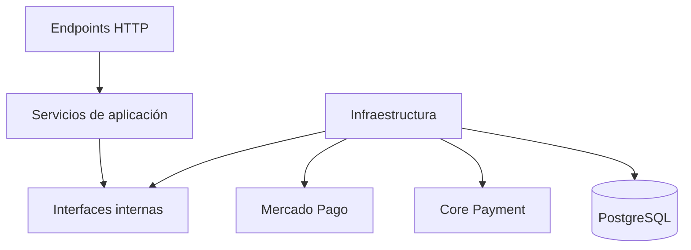

# Arquitectura lógica del plugin `paygw_mercadopago`

## Estado

**Paso 1 – Aceptado**

Este documento registra la primera decisión de arquitectura del plugin.

---

## Objetivo

Diseñar un gateway de pago para Moodle 5.2.1 que integre Mercado Pago mediante Checkout Pro, siguiendo buenas prácticas de diseño y principios SOLID, sin copiar el plugin oficial de PayPal.

---

## Arquitectura general

```mermaid
flowchart LR
    U[Usuario] --> EP[Endpoint de inicio]
    EP --> PS[Payment Service]

    PS --> MH[Moodle Payment Adapter]
    PS --> MP[Mercado Pago Client]
    PS --> TR[Transaction Repository]

    MP --> API[API Mercado Pago]
    PS --> U

    WH[Endpoint Webhook] --> WS[Webhook Service]
    WS --> SV[Signature Validator]
    WS --> MP
    WS --> TR
    WS --> MH

    MH --> CPM[Core Payment de Moodle]
    CPM --> SP[payment_helper::save_payment()]
    CPM --> DO[payment_helper::deliver_order()]
```

## Capas

### 1. Capa de entrada

Responsabilidades:

- Recibir solicitudes HTTP.
- Validar parámetros básicos.
- Delegar el procesamiento.

Entradas:

- Inicio del pago.
- Webhook de Mercado Pago.

El retorno del navegador **no confirma el pago**.

---

### 2. Capa de aplicación

Casos de uso:

- Crear una operación.
- Crear la preferencia.
- Procesar un webhook.
- Consultar el estado del pago.
- Confirmar operaciones aprobadas.
- Evitar duplicados.
- Solicitar a Moodle el registro y la entrega del pedido.

Servicios conceptuales:

- `payment_service`
- `webhook_service`
- `payment_confirmation_service`

---

### 3. Cliente Mercado Pago

Clase conceptual:

- `mercadopago_client`

Responsabilidades:

- Autenticación.
- Crear preferencias.
- Consultar pagos.
- Manejo de errores.
- Uso exclusivo de la clase `curl` de Moodle.

---

### 4. Seguridad del webhook

Clase conceptual:

- `webhook_signature_validator`

Responsabilidades:

- Validar `x-signature`.
- Validar `x-request-id`.
- Verificar autenticidad.
- Consultar posteriormente la API de Mercado Pago para confirmar el pago.

---

### 5. Integración con Moodle

Clase conceptual:

- `moodle_payment_adapter`

Responsabilidades:

- Validar la operación.
- Ejecutar `payment_helper::save_payment()`.
- Ejecutar `payment_helper::deliver_order()`.

Toda la interacción con `core_payment` quedará encapsulada en esta capa.

---

### 6. Persistencia

Clase conceptual:

- `transaction_repository`

La tabla propia del plugin almacenará, como mínimo:

- Operación Moodle.
- Preferencia Mercado Pago.
- Pago Mercado Pago.
- Estado.
- Estado de confirmación.
- Cantidad de intentos.
- Último error.
- Fecha de creación.
- Fecha de actualización.

Su finalidad es proporcionar:

- Idempotencia.
- Auditoría.
- Reintentos.
- Diagnóstico.

No reemplaza las tablas de `core_payment`.

---

## Regla de dependencias



Las dependencias siempre apuntan hacia la lógica de aplicación.

---

## Decisión de arquitectura aprobada

Se adopta una arquitectura por capas compuesta por:

- Endpoints HTTP.
- Servicios de aplicación.
- Cliente Mercado Pago.
- Validador de webhooks.
- Adaptador del subsistema de pagos de Moodle.
- Repositorio de operaciones.

La confirmación del pago será:

- mediante consulta a la API de Mercado Pago;
- independiente del retorno del navegador;
- idempotente;
- seguida del registro con `payment_helper::save_payment()` y de la entrega mediante `payment_helper::deliver_order()`.