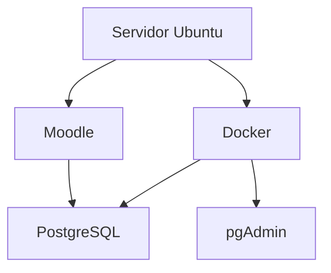
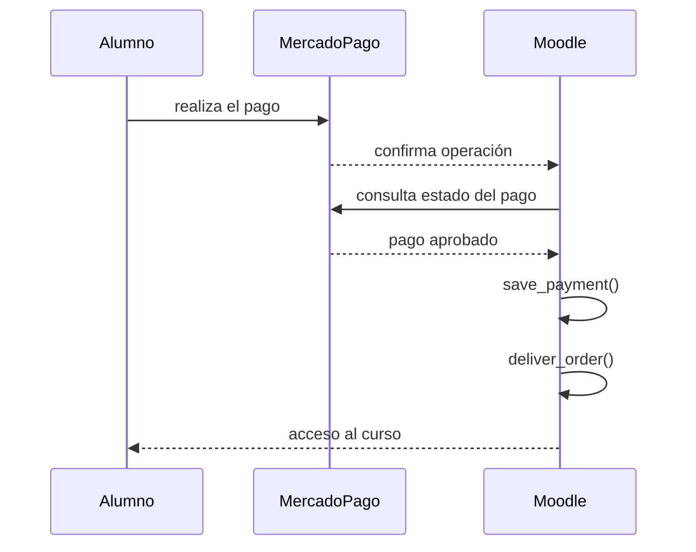

# Desarrollo del plugin Mercado Pago para Moodle

## Proyecto

Desarrollo de un gateway de pago para Moodle 5.2.1 utilizando Mercado Pago.

El objetivo es que un alumno pueda:

1. Registrarse en Moodle.
2. Pagar mediante Mercado Pago.
3. Confirmarse automáticamente el pago.
4. Matricularse automáticamente en el curso.
5. Acceder inmediatamente al contenido.

---

# Objetivos del proyecto

- Desarrollar un plugin nativo para Moodle.
- Compatible con Moodle 5.2.
- Código reutilizable.
- Publicable en GitHub.
- Documentación completa.
- Arquitectura mantenible.
- Utilizar únicamente APIs oficiales de Moodle y Mercado Pago.

---

# Forma de trabajo

Durante todo el desarrollo se seguirá la siguiente metodología:

- Un solo paso por vez.
- No avanzar hasta confirmar el paso.
- Documentar únicamente los pasos aceptados.
- Al finalizar generar una documentación completa en Markdown.
- Utilizar diagramas Mermaid.
- No utilizar emojis ni íconos.

---

# Entorno

## Sistema operativo

Ubuntu (DonWeb)

## Moodle

Versión:

```
5.2.1
(Build: 20260608)
```

## Código fuente

```
/home/portalpericial-campus/htdocs/campus.portalpericial.com.ar
```

## moodledata

```
/home/portalpericial-campus/htdocs/moodledata
```

## Base de datos

PostgreSQL 17

Ejecutándose en Docker.

## Administración

pgAdmin 9.16

Ejecutándose en Docker.

## Arquitectura



---

# Estructura detectada

Se verificó que la instalación utiliza la estructura moderna de Moodle 5.2.

```
campus.portalpericial.com.ar
│
├── admin
├── lib
├── public
├── scripts
├── config.php
├── composer.json
└── ...
```

Los gateways de pago se encuentran en:

```
public/payment/gateway
```

---

# Gateway oficial analizado

Se utilizó el gateway oficial de PayPal únicamente como referencia arquitectónica.

Ruta:

```
public/payment/gateway/paypal
```

Se analizaron los siguientes archivos:

```
classes/gateway.php
classes/paypal_helper.php
classes/external/get_config_for_js.php
classes/external/transaction_complete.php

db/install.php
db/install.xml
db/services.php

settings.php
version.php
```

No se copiará el código.

Se utilizará únicamente como referencia de diseño.

---

# Conclusiones obtenidas

## version.php

El componente del plugin deberá llamarse:

```
paygw_mercadopago
```

---

## gateway.php

Se confirmó que el gateway debe implementar:

- monedas soportadas
- formulario de configuración
- validación

---

## services.php

Los servicios AJAX se registran mediante:

```
db/services.php
```

---

## get_config_for_js.php

El gateway obtiene desde Moodle:

- componente
- paymentarea
- itemid
- importe
- moneda

---

## transaction_complete.php

Se confirmó el flujo oficial de Moodle.



También se confirmó que nunca debe confiarse en la información enviada por el navegador.

La validación debe hacerse consultando la API del proveedor de pagos.

---

## install.xml

Cada gateway posee una tabla propia.

PayPal almacena la relación:

```
paymentid
↓

pp_orderid
```

Nuestro plugin tendrá una tabla equivalente para Mercado Pago.

---

## paypal_helper.php

Se confirmó que Moodle utiliza su propia clase:

```
curl
```

No es obligatorio utilizar un SDK externo.

Se decidió utilizar directamente la API REST de Mercado Pago.

---

## settings.php

Los parámetros generales del gateway se agregan mediante:

```
core_payment\helper::add_common_gateway_settings()
```

---

## install.php

El gateway se registra automáticamente al instalarse.

---

# Decisiones de arquitectura

Se acordó que:

- No modificar el código de Moodle.
- Desarrollar un plugin independiente.
- Utilizar PHP.
- Utilizar la clase curl de Moodle.
- Utilizar la API REST de Mercado Pago.
- Confirmar todos los pagos mediante la API.
- Utilizar webhooks.
- Registrar los pagos mediante:

```
payment_helper::save_payment()
```

- Entregar el acceso mediante:

```
payment_helper::deliver_order()
```

---

# Estructura prevista del plugin

Todavía no implementada.

Se diseñará antes de comenzar a programar.

Propuesta inicial:

```text
paygw_mercadopago
│
├── classes
│   ├── gateway.php
│   ├── mercadopago_client.php
│   ├── payment_service.php
│   ├── webhook_service.php
│   ├── preference_service.php
│   └── external
│
├── db
│
├── lang
│
├── templates
│
├── pix
│
├── tests
│
├── version.php
│
└── settings.php
```

Esta estructura podrá ajustarse durante el diseño definitivo.

---

# VS Code

Se decidió abandonar el desarrollo exclusivamente por consola.

Se configuró:

- VS Code
- Remote SSH

Conexión exitosa al servidor.

Inicialmente se utilizó el usuario:

```
root
```

Posteriormente se configuró correctamente el acceso SSH para:

```
portalpericial-campus
```

utilizando autenticación mediante clave pública.

Se verificó que el acceso funciona correctamente.

A partir de este punto el desarrollo continuará utilizando VS Code conectado como:

```
portalpericial-campus
```

---

# Git

Se decidió que:

No se utilizará Git sobre toda la instalación de Moodle.

Cada plugin tendrá su propio repositorio independiente.

Esto permitirá:

- versionado independiente
- publicación en GitHub
- reutilización en otras instalaciones
- mantenimiento sencillo

---

# Estado actual

Se encuentra finalizada la etapa de investigación.

No se continuará inspeccionando archivos del core de Moodle.

En la siguiente etapa comenzará el diseño del plugin y posteriormente su implementación.

El siguiente paso será:

1. Inicializar Git para el plugin.
2. Diseñar la arquitectura definitiva.
3. Crear la estructura mínima del plugin.
4. Instalar el plugin en Moodle.
5. Comenzar el desarrollo funcional.

# Fase 1 - Validación final

## Registro del gateway en Moodle

Durante la implementación se verificó que el plugin era detectado e instalado correctamente por Moodle y que la tabla `paygw_mercadopago_transactions` se creaba sin inconvenientes.

Sin embargo, el gateway Mercado Pago no aparecía en la lista de portales de pago.

Luego de analizar el funcionamiento del subsistema `core_payment` se comprobó que Moodle utiliza la configuración `paygw_plugins_sortorder` para determinar los gateways habilitados.

Se implementó:

- `db/install.php` para registrar automáticamente el gateway en instalaciones nuevas.
- `db/upgrade.php` para registrar el gateway en instalaciones donde el plugin ya se encontraba instalado.

Se incrementó la versión del plugin a:

```php
$plugin->version = 2026071302;
```

Se ejecutó la actualización del plugin desde la administración de Moodle.

## Resultado de las pruebas

Se verificó correctamente que:

- Moodle detecta el plugin `paygw_mercadopago`.
- El plugin se instala sin errores.
- Se crea la tabla `paygw_mercadopago_transactions`.
- Moodle reconoce Mercado Pago como un gateway de pago.
- Mercado Pago aparece junto a PayPal en la pantalla **Administración del sitio → General → Pagos → Cuentas para pago**.

Con esta validación se considera finalizada la **Fase 1 – Esqueleto del plugin** y se da inicio a la **Fase 2 – Configuración del gateway**.

# Fase 2 - Configuración del gateway

## Objetivo

Implementar y validar la configuración del gateway Mercado Pago para cada cuenta de pago de Moodle, utilizando exclusivamente el mecanismo estándar de configuración provisto por `core_payment`.

---

## Configuración implementada

Se implementó la configuración por cuenta de pago con los siguientes parámetros:

- Habilitar gateway.
- Entorno.
- Access Token.
- Secreto del Webhook.

No se incorporó configuración global del plugin, de acuerdo con la arquitectura aprobada.

---

## Ayuda contextual

Se agregaron textos de ayuda para los tres parámetros configurables.

### Entorno

Describe la diferencia entre:

- Sandbox
- Producción

### Access Token

Indica que debe pegarse el Access Token correspondiente al entorno seleccionado y que constituye información confidencial.

### Secreto del Webhook

Describe que el valor será utilizado para validar la autenticidad de las notificaciones enviadas por Mercado Pago.

Para implementar correctamente la ayuda contextual fue necesario agregar tanto las cadenas:

```php
$string['...']
```

como las correspondientes:

```php
$string['..._help']
```

ya que `addHelpButton()` utiliza ambas.

---

## Validaciones implementadas

La configuración valida:

### Access Token

- obligatorio cuando el gateway está habilitado;
- eliminación de espacios mediante `trim()`;
- longitud mínima de 20 caracteres.

### Webhook Secret

- obligatorio cuando el gateway está habilitado;
- eliminación de espacios mediante `trim()`;
- longitud mínima de 16 caracteres.

Las validaciones se implementaron dentro de:

```
classes/gateway.php
```

utilizando el método:

```
validate_gateway_form()
```

---

## Pruebas realizadas

Se verificó correctamente:

- aparición del gateway en la configuración de la cuenta de pago;
- visualización de los cuatro parámetros configurables;
- funcionamiento de la ayuda contextual;
- validación de campos obligatorios;
- validación de longitud mínima;
- almacenamiento correcto de la configuración;
- recuperación correcta de la configuración al volver a abrir el formulario;
- conservación del entorno seleccionado;
- almacenamiento seguro de Access Token y Webhook Secret utilizando campos de tipo `passwordunmask`.

---

## Incidencia detectada

Durante las pruebas, Moodle mostró mensajes del tipo:

```
[[webhooksecret_desc_help]]
```

y posteriormente:

```
[[webhooksecretinvalidlength]]
```

El problema no estaba en el código sino en la caché de idiomas de Moodle.

La solución fue ejecutar:

```
Administración del sitio
→ Desarrollo
→ Purgar todas las cachés
```

Después de purgar la caché, Moodle reconoció correctamente las nuevas cadenas de idioma.

---

## Observaciones

Durante el desarrollo se verificó que:

- modificar archivos `lang/es` o `lang/en` requiere purgar la caché de Moodle antes de realizar nuevas pruebas;
- `Ctrl + F5` únicamente recarga el navegador y no actualiza la caché de idiomas del servidor;
- las validaciones definidas en `validate_gateway_form()` se ejecutan únicamente al presionar **Guardar cambios**;
- los campos `passwordunmask` almacenan correctamente las credenciales y las muestran enmascaradas al volver a abrir el formulario.

---

## Estado

Fase 2 finalizada.

Resultado:

- configuración completamente funcional;
- validaciones implementadas;
- ayuda contextual implementada;
- persistencia de configuración verificada.

La siguiente etapa será la **Fase 3 – Persistencia**, comenzando con la implementación del `transaction_repository`.

# Fase 3 - Capa de persistencia

## Objetivo

Implementar la capa de persistencia del plugin mediante un repositorio dedicado, desacoplando completamente el acceso a la base de datos del resto de la lógica del sistema.

La implementación sigue el patrón Repository definido en la arquitectura aprobada.

---

## Modelo de datos

Se revisó la estructura de la tabla:

```
paygw_mercadopago_transactions
```

Se verificó que el modelo implementado coincide con la arquitectura aprobada.

No fue necesario modificar:

- campos;
- claves primarias;
- claves foráneas;
- índices;
- restricciones.

La tabla quedó aprobada como modelo definitivo de persistencia.

---

## Implementación del Transaction Repository

Se implementó:

```
classes/local/repository/transaction_repository.php
```

Este repositorio constituye el único punto de acceso a la tabla:

```
paygw_mercadopago_transactions
```

No contiene reglas de negocio.

Toda su responsabilidad consiste exclusivamente en leer y escribir información en la base de datos.

---

## Métodos implementados

Se implementaron los siguientes métodos públicos:

- create()
- find_by_id()
- find_by_external_reference()
- find_by_preference_id()
- find_by_payment_id()
- save_preference()
- save_payment_reference()
- update_status()
- increment_attempts()
- register_error()
- mark_as_delivered()

Además se implementó el método privado:

- update_fields()

para centralizar las actualizaciones parciales de registros.

---

## Criterios de diseño

Durante el desarrollo se tomaron las siguientes decisiones:

- toda operación sobre la tabla debe realizarse exclusivamente mediante el repositorio;
- ningún otro componente accederá directamente a `$DB`;
- los valores por defecto (`created`, `attempts`, `delivered`, fechas) se inicializan dentro del repositorio;
- las actualizaciones parciales reutilizan un único método interno para evitar duplicación de código;
- el repositorio no contiene lógica de negocio relacionada con Mercado Pago.

---

## Pruebas realizadas

Se desarrolló un script temporal de prueba para validar el funcionamiento completo del repositorio contra la base de datos real.

Durante las pruebas se verificó correctamente:

- creación de transacciones;
- búsqueda por ID;
- búsqueda por External Reference;
- búsqueda por Preference ID;
- búsqueda por Payment ID;
- almacenamiento de Preference ID;
- almacenamiento de Payment ID;
- actualización de estados;
- incremento de intentos;
- registro de errores;
- marcado como entregado;
- eliminación automática de la transacción temporal al finalizar la prueba.

Todas las operaciones finalizaron correctamente.

---

## Incidencias detectadas

Inicialmente Moodle no encontraba la clase:

```
paygw_mercadopago\local\repository\transaction_repository
```

La causa fue la caché de clases de Moodle.

La solución consistió en ejecutar:

```
Administración del sitio
→ Desarrollo
→ Purgar todas las cachés
```

Después de purgar la caché, el autoload detectó correctamente la nueva clase.

---

## Scripts temporales

Durante el desarrollo se utilizó un script administrativo temporal para validar el repositorio.

Dicho archivo debe eliminarse antes de generar una versión pública del plugin.

No forma parte de la implementación definitiva.

---

## Estado

Fase 3 finalizada.

Resultado:

- modelo de persistencia validado;
- repositorio implementado;
- repositorio probado sobre la base de datos real;
- capa de persistencia aprobada para ser utilizada por los servicios de negocio.

dev_repository_test.php es un script de apoyo al desarrollo. No forma parte del flujo normal del plugin y no debe ejecutarse desde procesos automáticos. Puede conservarse durante el desarrollo para verificar rápidamente la integridad del repositorio.

La siguiente etapa será la **Fase 4 – Servicios**, comenzando por `payment_service`.

# Fase 4 - Payment Service

## Objetivo

Implementar el servicio responsable de iniciar una operación de pago, coordinando la creación de la transacción local con la generación de la preferencia de Mercado Pago.

---

## Componentes implementados

Se implementaron los siguientes componentes:

- `classes/local/service/payment_service.php`
- `classes/local/client/mercadopago_client.php`

El `payment_service` coordina el inicio de la operación y delega toda la comunicación HTTP con Mercado Pago al `mercadopago_client`.

---

## Responsabilidades del payment_service

El servicio implementa el siguiente flujo:

1. Validar los datos recibidos.
2. Generar un `externalreference` único (UUID v4).
3. Crear la transacción mediante `transaction_repository`.
4. Solicitar la creación de la preferencia al cliente de Mercado Pago.
5. Guardar el `preferenceid`.
6. Actualizar el estado de la transacción a `pending`.
7. Devolver el `initpoint` para redireccionar al Checkout Pro.

El servicio no realiza llamadas HTTP directamente ni contiene lógica de integración con Moodle distinta al inicio de la operación.

---

## Responsabilidades del mercadopago_client

El cliente encapsula toda la comunicación con la API REST de Mercado Pago.

Sus responsabilidades son:

- crear preferencias de Checkout Pro;
- consultar pagos;
- enviar solicitudes HTTP utilizando la clase `curl` de Moodle;
- interpretar las respuestas JSON;
- devolver respuestas normalizadas al resto del plugin.

---

## Pruebas realizadas

Se desarrolló un script administrativo temporal:

```
dev_payment_service_test.php
```

utilizando un cliente simulado para evitar llamadas reales a Mercado Pago.

Se verificó correctamente:

- creación de la transacción;
- generación de `externalreference`;
- creación de una preferencia simulada;
- almacenamiento de `preferenceid`;
- actualización del estado a `pending`;
- devolución del `initpoint`.

Posteriormente se simuló un error durante la creación de la preferencia.

Se verificó correctamente:

- propagación de la excepción;
- registro del error mediante `register_error()`;
- actualización del estado de la transacción a `error`;
- almacenamiento del mensaje en `lasterror`.

Las pruebas se realizaron sobre la base de datos real del plugin.

---

## Scripts temporales

Durante el desarrollo se incorporó:

```
dev_payment_service_test.php
```

Este archivo es un script de apoyo al desarrollo.

No forma parte del funcionamiento normal del plugin y deberá excluirse de una futura publicación oficial.

---

## Estado

Fase 4 finalizada.

Resultado:

- `payment_service` implementado;
- `mercadopago_client` implementado;
- flujo exitoso validado;
- manejo de errores validado;
- integración con el repositorio verificada.

La siguiente etapa será la implementación del flujo real de integración entre Moodle y Mercado Pago para iniciar el Checkout Pro.

# Configuración de Mercado Pago Developers

Durante la Fase 5 fue necesario configurar correctamente una aplicación de prueba en Mercado Pago para que el plugin pudiera crear preferencias de pago mediante la API.

## 1. Ingresar a Mercado Pago Developers

Ingresar con la misma cuenta de Mercado Pago utilizada para el desarrollo.

https://www.mercadopago.com.ar/developers/

## 2. Abrir la sección Integraciones

En la barra superior seleccionar:

```
Integraciones
```

Si no existe una integración, crear una nueva aplicación.

## 3. Obtener las credenciales de prueba

Dentro de la integración ingresar a:

```
Credenciales de prueba
```

Copiar el valor:

```
Access Token
```

No utilizar la **Public Key**, ya que el backend del plugin necesita autenticarse mediante el Access Token.

## 4. Configurar Moodle

Ingresar como administrador:

```
Administración del sitio
    → General
        → Pagos
            → Cuentas para pago
```

Editar la cuenta de Mercado Pago configurada para pruebas.

Completar:

- Access Token
- Entorno: Sandbox

Guardar los cambios.

## 5. Configurar una inscripción paga

Habilitar el plugin de inscripción por pago.

Luego ingresar al curso:

```
Participantes
    → Métodos de matriculación
        → Añadir método
            → Inscripción en pago
```

Configurar como mínimo:

- Cuenta para pago: Cuenta de prueba de Mercado Pago
- Tasa de inscripción: 100
- Moneda: Peso argentino
- Método habilitado

Guardar.

## 6. Verificación en la base de datos

Se comprobó que Moodle creó correctamente la inscripción paga.

Consulta utilizada:

```sql
SELECT id,
       courseid,
       enrol,
       status,
       cost,
       currency
FROM mdl_enrol
WHERE enrol = 'fee'
ORDER BY id DESC;
```

Resultado obtenido:

| id | courseid | enrol | cost | currency |
|----|---------:|--------|-----:|----------|
| 4  | 2        | fee    | 100  | ARS      |

## 7. Primer error encontrado

Al intentar crear una preferencia se obtuvo:

```
HTTP 403
At least one policy returned UNAUTHORIZED
```

### Causa

El Access Token configurado en Moodle no tenía autorización para crear preferencias.

### Solución

Reemplazar el Access Token por el obtenido desde **Credenciales de prueba** de Mercado Pago Developers.

## 8. Prueba exitosa

Luego de actualizar el Access Token, el script de prueba devolvió correctamente:

```text
transactionid      => 10
externalreference  => 038fc595-eb84-4aea-80e9-80b1e1257f26
preferenceid       => 3544226421-1f8b4ac0-5df7-494b-85d3-011bd4b2d369
initpoint          => https://sandbox.mercadopago.com.ar/checkout/...
```

## Resultado

Se verificó exitosamente el flujo completo:

```
Moodle
    ↓
External API
    ↓
payment_service
    ↓
transaction_repository
    ↓
mercadopago_client
    ↓
Mercado Pago Sandbox
    ↓
Creación de Preference
    ↓
Obtención del Checkout Pro (Init Point)
```

Con esta prueba quedó validada la comunicación entre Moodle y la API de Mercado Pago, obteniendo una Preference real y la URL de Checkout Pro en el entorno Sandbox.

## Fase 6 – Recepción y validación del Webhook de Mercado Pago

### Objetivo

Implementar la infraestructura necesaria para recibir las notificaciones Webhook enviadas por Mercado Pago, validar su autenticidad mediante firma HMAC y dejar preparada la arquitectura para que, en la Fase 7, pueda confirmarse el pago y habilitar automáticamente el acceso al curso en Moodle.

---

## Decisiones de arquitectura

Antes de comenzar la implementación se revisó nuevamente el diseño del Webhook para mantener una correcta separación de responsabilidades.

Se adoptó la siguiente arquitectura:

```text
Mercado Pago
        │
        ▼
webhook.php
        │
        ├── Lee HTTP
        ├── Obtiene accountid
        ├── Recupera webhooksecret
        ├── Construye webhook_notification
        ▼
webhook_service
        │
        ▼
webhook_signature_validator
        │
        ▼
payment_confirmation_interface
```

Cada componente tiene una única responsabilidad:

| Componente | Responsabilidad |
|------------|-----------------|
| webhook.php | Adaptar la petición HTTP al modelo interno del plugin |
| webhook_notification | Representar únicamente la información recibida desde Mercado Pago |
| webhook_service | Coordinar el procesamiento del Webhook |
| webhook_signature_validator | Validar criptográficamente la firma |
| payment_confirmation_interface | Definir el contrato para confirmar pagos (implementación en Fase 7) |

---

## Inclusión del accountid en la preferencia

Durante la revisión de la arquitectura se detectó un problema importante.

Para validar la firma del Webhook era necesario recuperar el `webhooksecret` correspondiente a la cuenta de pago utilizada para generar la preferencia.

Como Moodle permite múltiples cuentas de pago, el endpoint debía conocer qué cuenta había originado la preferencia.

Por este motivo se modificó:

### classes/local/service/payment_service.php

Se agregó:

```php
'accountid' => $accountid,
```

al crear la preferencia.

Posteriormente se modificó:

### classes/local/api/mercadopago_client.php

La URL del Webhook pasó de:

```php
/payment/gateway/mercadopago/webhook.php
```

a:

```php
/payment/gateway/mercadopago/webhook.php?accountid=...
```

También se agregó `accountid` como dato obligatorio dentro de la validación de preferencias.

---

## Excepción específica para Webhooks

Se creó:

```text
classes/local/exception/invalid_webhook_exception.php
```

Esta excepción permite diferenciar claramente:

- errores provocados por una notificación inválida;
- errores internos del servidor.

---

## DTO del Webhook

Se creó:

```text
classes/local/dto/webhook_notification.php
```

Este DTO representa únicamente los datos enviados por Mercado Pago:

- topic
- paymentid
- signature
- requestid

### Decisión arquitectónica

Inicialmente el DTO incluía también el `webhooksecret`.

Durante la revisión se decidió eliminarlo porque:

- el secreto no forma parte de la notificación;
- pertenece a la configuración interna del gateway;
- debe recuperarse desde Moodle;
- no corresponde mezclar datos externos con configuración interna.

El DTO quedó representando exclusivamente el evento recibido desde Mercado Pago.

---

## Validador de firma

Se implementó:

```text
classes/local/validation/webhook_signature_validator.php
```

Responsabilidades:

- validar parámetros obligatorios;
- interpretar el encabezado `X-Signature`;
- extraer `ts`;
- extraer `v1`;
- construir el manifiesto oficial de Mercado Pago;
- calcular el HMAC SHA-256;
- comparar utilizando `hash_equals()`;
- lanzar `invalid_webhook_exception` cuando corresponda.

El manifiesto utilizado es:

```text
id:{paymentid};request-id:{requestid};ts:{timestamp};
```

---

## Mejora del diseño del validador

Inicialmente el validador recibía cuatro parámetros:

- signature
- requestid
- paymentid
- secret

Durante la revisión arquitectónica se decidió simplificar su interfaz.

Ahora recibe:

```php
validate(
    webhook_notification $notification,
    string $secret
)
```

Esto reduce el acoplamiento y evita modificar la firma del método si Mercado Pago incorpora nuevos datos al algoritmo de validación.

---

## Interfaz para confirmar pagos

Se creó:

```text
classes/local/service/payment_confirmation_interface.php
```

con el contrato:

```php
public function confirm(string $paymentid): void;
```

La implementación concreta quedará para la Fase 7.

---

## Servicio del Webhook

Se implementó:

```text
classes/local/service/webhook_service.php
```

Responsabilidades:

- verificar que el tópico recibido sea `payment`;
- delegar la validación de la firma;
- delegar la confirmación del pago.

El servicio no conoce:

- HTTP;
- JSON;
- variables GET;
- encabezados;
- configuración de Moodle.

Toda esa responsabilidad quedó concentrada en `webhook.php`.

---

## Recuperación de la configuración del gateway

Antes de implementar el endpoint se revisó la API oficial del subsistema de pagos de Moodle.

En lugar de acceder directamente a la base de datos se decidió utilizar:

```php
core_payment\account_gateway
```

La configuración se obtiene mediante:

```php
account_gateway::get_record([
    'accountid' => $accountid,
    'gateway' => 'mercadopago',
]);
```

Posteriormente:

```php
$gatewayconfig = $accountgateway->get_configuration();
```

De esta configuración se recupera el:

```text
webhooksecret
```

Esta solución utiliza exclusivamente la API oficial de Moodle y evita consultas manuales sobre la base de datos.

---

## Implementación de webhook.php

Se creó el endpoint público:

```text
payment/gateway/mercadopago/webhook.php
```

Responsabilidades:

1. cargar Moodle;
2. leer la petición HTTP;
3. obtener el `accountid`;
4. recuperar la configuración del gateway;
5. obtener el `webhooksecret`;
6. leer JSON, GET y encabezados HTTP;
7. construir `webhook_notification`;
8. crear los servicios necesarios;
9. ejecutar `webhook_service`;
10. devolver el código HTTP correspondiente.

El endpoint responde:

| HTTP | Resultado |
|------|-----------|
| 200 | ok |
| 400 | invalid_notification |
| 500 | internal_error |

---

## Verificaciones realizadas

Se verificó sintácticamente el endpoint mediante:

```bash
php -l webhook.php
```

Resultado:

```text
No syntax errors detected in webhook.php
```

Durante la validación apareció una advertencia de incompatibilidad entre la versión instalada de Xdebug y PHP.

La advertencia no afecta el funcionamiento del plugin y quedó pendiente como una tarea independiente del desarrollo.

---

## Estado al finalizar la Fase 6

Al finalizar esta fase quedó implementada toda la infraestructura del Webhook:

- URL de notificación preparada.
- Identificación de la cuenta de pago.
- Recuperación segura del `webhooksecret`.
- DTO para representar la notificación.
- Validación criptográfica de firmas.
- Servicio coordinador del Webhook.
- Interfaz para la futura confirmación del pago.
- Endpoint HTTP completo.
- Arquitectura desacoplada y alineada con el subsistema de pagos de Moodle.

Aún no se confirma el pago ni se entrega el curso.

Esa funcionalidad será implementada completamente durante la **Fase 7** mediante `payment_confirmation_service`.

# Fase 7 – Confirmación automática del pago e inscripción en el curso

## Objetivo

Completar el flujo de pago integrando la confirmación automática desde Mercado Pago con el sistema de pagos de Moodle, registrando el pago y entregando la orden correspondiente para matricular automáticamente al alumno en el curso adquirido.

---

## Componentes implementados

### payment_confirmation_service

Se implementó el servicio encargado de confirmar un pago consultando directamente la API de Mercado Pago a partir del `payment_id` recibido en el Webhook.

Responsabilidades:

- Consultar el pago mediante la API oficial de Mercado Pago.
- Validar que el pago exista.
- Obtener toda la información del pago.
- Actualizar la transacción almacenada en el repositorio.
- Registrar el `payment_id`.
- Registrar el estado del pago.
- Evitar reprocesar pagos ya entregados.

---

### webhook_service

El servicio de Webhook quedó encargado de:

- Procesar únicamente notificaciones del tipo `payment`.
- Validar la estructura de la notificación recibida.
- Delegar la confirmación del pago al `payment_confirmation_service`.

Las notificaciones de tipo `merchant_order` son ignoradas, respondiendo HTTP 200 para evitar reintentos innecesarios por parte de Mercado Pago.

---

### Integración con Moodle

Una vez confirmado el pago:

1. Se registra el pago mediante:

```php
payment_helper::save_payment(...)
```

2. Se entrega la orden mediante:

```php
payment_helper::deliver_order(...)
```

La entrega de la orden realiza automáticamente la inscripción del alumno utilizando la infraestructura estándar de `core_payment` de Moodle.

No fue necesario implementar lógica propia de matriculación.

---

## Flujo completo

Alumno

↓

Selecciona Mercado Pago

↓

Checkout Pro

↓

Pago aprobado

↓

Webhook de Mercado Pago

↓

Consulta API Mercado Pago

↓

Confirmación del pago

↓

Registro del pago en Moodle

↓

Entrega de la orden

↓

Inscripción automática en el curso

---

## Pruebas realizadas

Se realizaron pruebas completas utilizando credenciales Sandbox de Mercado Pago.

Se verificó correctamente:

- creación de preferencias;
- redirección a Checkout Pro;
- aprobación del pago;
- recepción del Webhook;
- consulta del pago mediante API;
- actualización de la transacción;
- registro del pago en Moodle;
- entrega automática de la orden;
- inscripción automática del alumno;
- respuesta HTTP 200 del Webhook.

---

## Resultado

Quedó implementado el flujo completo de compra de cursos mediante Mercado Pago utilizando Checkout Pro y la infraestructura nativa de pagos de Moodle.

El alumno obtiene automáticamente acceso al curso inmediatamente después de que Mercado Pago confirma el pago.

# Pendientes para la versión 1.0

- Revisar la implementación de la validación HMAC de los Webhooks utilizando la implementación oficial de Mercado Pago o una equivalente.
- Realizar pruebas completas de los estados:
  - approved;
  - pending;
  - rejected;
  - cancelled;
  - refunded;
  - chargeback.
- Validar reintentos automáticos de Webhooks.
- Ejecutar pruebas en entorno de producción antes de la publicación de la versión estable.