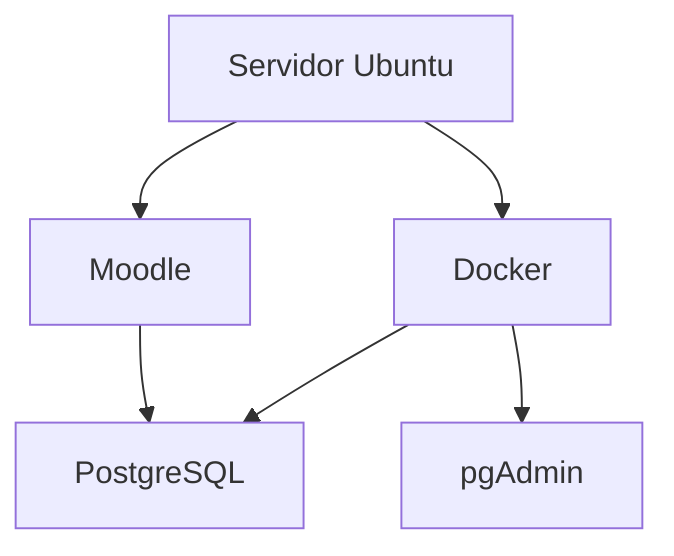
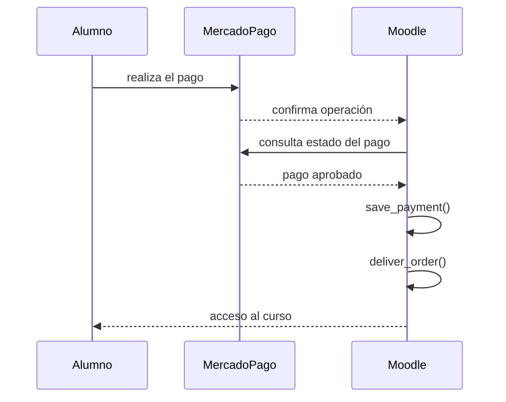

# Desarrollo del plugin Mercado Pago para Moodle

## Proyecto

Desarrollo de un gateway de pago para Moodle 5.2.1 utilizando Mercado Pago.

El objetivo es que un alumno pueda:

1. Registrarse en Moodle.
2. Pagar mediante Mercado Pago.
3. Confirmarse automáticamente el pago.
4. Matricularse automáticamente en el curso.
5. Acceder inmediatamente al contenido.

---

# Objetivos del proyecto

- Desarrollar un plugin nativo para Moodle.
- Compatible con Moodle 5.2.
- Código reutilizable.
- Publicable en GitHub.
- Documentación completa.
- Arquitectura mantenible.
- Utilizar únicamente APIs oficiales de Moodle y Mercado Pago.

---

# Forma de trabajo

Durante todo el desarrollo se seguirá la siguiente metodología:

- Un solo paso por vez.
- No avanzar hasta confirmar el paso.
- Documentar únicamente los pasos aceptados.
- Al finalizar generar una documentación completa en Markdown.
- Utilizar diagramas Mermaid.
- No utilizar emojis ni íconos.

---

# Entorno

## Sistema operativo

Ubuntu (DonWeb)

## Moodle

Versión:

```
5.2.1
(Build: 20260608)
```

## Código fuente

```
/home/portalpericial-campus/htdocs/campus.portalpericial.com.ar
```

## moodledata

```
/home/portalpericial-campus/htdocs/moodledata
```

## Base de datos

PostgreSQL 17

Ejecutándose en Docker.

## Administración

pgAdmin 9.16

Ejecutándose en Docker.

## Arquitectura



---

# Estructura detectada

Se verificó que la instalación utiliza la estructura moderna de Moodle 5.2.

```
campus.portalpericial.com.ar
│
├── admin
├── lib
├── public
├── scripts
├── config.php
├── composer.json
└── ...
```

Los gateways de pago se encuentran en:

```
public/payment/gateway
```

---

# Gateway oficial analizado

Se utilizó el gateway oficial de PayPal únicamente como referencia arquitectónica.

Ruta:

```
public/payment/gateway/paypal
```

Se analizaron los siguientes archivos:

```
classes/gateway.php
classes/paypal_helper.php
classes/external/get_config_for_js.php
classes/external/transaction_complete.php

db/install.php
db/install.xml
db/services.php

settings.php
version.php
```

No se copiará el código.

Se utilizará únicamente como referencia de diseño.

---

# Conclusiones obtenidas

## version.php

El componente del plugin deberá llamarse:

```
paygw_mercadopago
```

---

## gateway.php

Se confirmó que el gateway debe implementar:

- monedas soportadas
- formulario de configuración
- validación

---

## services.php

Los servicios AJAX se registran mediante:

```
db/services.php
```

---

## get_config_for_js.php

El gateway obtiene desde Moodle:

- componente
- paymentarea
- itemid
- importe
- moneda

---

## transaction_complete.php

Se confirmó el flujo oficial de Moodle.



También se confirmó que nunca debe confiarse en la información enviada por el navegador.

La validación debe hacerse consultando la API del proveedor de pagos.

---

## install.xml

Cada gateway posee una tabla propia.

PayPal almacena la relación:

```
paymentid
↓

pp_orderid
```

Nuestro plugin tendrá una tabla equivalente para Mercado Pago.

---

## paypal_helper.php

Se confirmó que Moodle utiliza su propia clase:

```
curl
```

No es obligatorio utilizar un SDK externo.

Se decidió utilizar directamente la API REST de Mercado Pago.

---

## settings.php

Los parámetros generales del gateway se agregan mediante:

```
core_payment\helper::add_common_gateway_settings()
```

---

## install.php

El gateway se registra automáticamente al instalarse.

---

# Decisiones de arquitectura

Se acordó que:

- No modificar el código de Moodle.
- Desarrollar un plugin independiente.
- Utilizar PHP.
- Utilizar la clase curl de Moodle.
- Utilizar la API REST de Mercado Pago.
- Confirmar todos los pagos mediante la API.
- Utilizar webhooks.
- Registrar los pagos mediante:

```
payment_helper::save_payment()
```

- Entregar el acceso mediante:

```
payment_helper::deliver_order()
```

---

# Estructura prevista del plugin

Todavía no implementada.

Se diseñará antes de comenzar a programar.

Propuesta inicial:

```text
paygw_mercadopago
│
├── classes
│   ├── gateway.php
│   ├── mercadopago_client.php
│   ├── payment_service.php
│   ├── webhook_service.php
│   ├── preference_service.php
│   └── external
│
├── db
│
├── lang
│
├── templates
│
├── pix
│
├── tests
│
├── version.php
│
└── settings.php
```

Esta estructura podrá ajustarse durante el diseño definitivo.

---

# VS Code

Se decidió abandonar el desarrollo exclusivamente por consola.

Se configuró:

- VS Code
- Remote SSH

Conexión exitosa al servidor.

Inicialmente se utilizó el usuario:

```
root
```

Posteriormente se configuró correctamente el acceso SSH para:

```
portalpericial-campus
```

utilizando autenticación mediante clave pública.

Se verificó que el acceso funciona correctamente.

A partir de este punto el desarrollo continuará utilizando VS Code conectado como:

```
portalpericial-campus
```

---

# Git

Se decidió que:

No se utilizará Git sobre toda la instalación de Moodle.

Cada plugin tendrá su propio repositorio independiente.

Esto permitirá:

- versionado independiente
- publicación en GitHub
- reutilización en otras instalaciones
- mantenimiento sencillo

---

# Estado actual

Se encuentra finalizada la etapa de investigación.

No se continuará inspeccionando archivos del core de Moodle.

En la siguiente etapa comenzará el diseño del plugin y posteriormente su implementación.

El siguiente paso será:

1. Inicializar Git para el plugin.
2. Diseñar la arquitectura definitiva.
3. Crear la estructura mínima del plugin.
4. Instalar el plugin en Moodle.
5. Comenzar el desarrollo funcional.

# Fase 1 - Validación final

## Registro del gateway en Moodle

Durante la implementación se verificó que el plugin era detectado e instalado correctamente por Moodle y que la tabla `paygw_mercadopago_transactions` se creaba sin inconvenientes.

Sin embargo, el gateway Mercado Pago no aparecía en la lista de portales de pago.

Luego de analizar el funcionamiento del subsistema `core_payment` se comprobó que Moodle utiliza la configuración `paygw_plugins_sortorder` para determinar los gateways habilitados.

Se implementó:

- `db/install.php` para registrar automáticamente el gateway en instalaciones nuevas.
- `db/upgrade.php` para registrar el gateway en instalaciones donde el plugin ya se encontraba instalado.

Se incrementó la versión del plugin a:

```php
$plugin->version = 2026071302;
```

Se ejecutó la actualización del plugin desde la administración de Moodle.

## Resultado de las pruebas

Se verificó correctamente que:

- Moodle detecta el plugin `paygw_mercadopago`.
- El plugin se instala sin errores.
- Se crea la tabla `paygw_mercadopago_transactions`.
- Moodle reconoce Mercado Pago como un gateway de pago.
- Mercado Pago aparece junto a PayPal en la pantalla **Administración del sitio → General → Pagos → Cuentas para pago**.

Con esta validación se considera finalizada la **Fase 1 – Esqueleto del plugin** y se da inicio a la **Fase 2 – Configuración del gateway**.

# Fase 2 - Configuración del gateway

## Objetivo

Implementar y validar la configuración del gateway Mercado Pago para cada cuenta de pago de Moodle, utilizando exclusivamente el mecanismo estándar de configuración provisto por `core_payment`.

---

## Configuración implementada

Se implementó la configuración por cuenta de pago con los siguientes parámetros:

- Habilitar gateway.
- Entorno.
- Access Token.
- Secreto del Webhook.

No se incorporó configuración global del plugin, de acuerdo con la arquitectura aprobada.

---

## Ayuda contextual

Se agregaron textos de ayuda para los tres parámetros configurables.

### Entorno

Describe la diferencia entre:

- Sandbox
- Producción

### Access Token

Indica que debe pegarse el Access Token correspondiente al entorno seleccionado y que constituye información confidencial.

### Secreto del Webhook

Describe que el valor será utilizado para validar la autenticidad de las notificaciones enviadas por Mercado Pago.

Para implementar correctamente la ayuda contextual fue necesario agregar tanto las cadenas:

```php
$string['...']
```

como las correspondientes:

```php
$string['..._help']
```

ya que `addHelpButton()` utiliza ambas.

---

## Validaciones implementadas

La configuración valida:

### Access Token

- obligatorio cuando el gateway está habilitado;
- eliminación de espacios mediante `trim()`;
- longitud mínima de 20 caracteres.

### Webhook Secret

- obligatorio cuando el gateway está habilitado;
- eliminación de espacios mediante `trim()`;
- longitud mínima de 16 caracteres.

Las validaciones se implementaron dentro de:

```
classes/gateway.php
```

utilizando el método:

```
validate_gateway_form()
```

---

## Pruebas realizadas

Se verificó correctamente:

- aparición del gateway en la configuración de la cuenta de pago;
- visualización de los cuatro parámetros configurables;
- funcionamiento de la ayuda contextual;
- validación de campos obligatorios;
- validación de longitud mínima;
- almacenamiento correcto de la configuración;
- recuperación correcta de la configuración al volver a abrir el formulario;
- conservación del entorno seleccionado;
- almacenamiento seguro de Access Token y Webhook Secret utilizando campos de tipo `passwordunmask`.

---

## Incidencia detectada

Durante las pruebas, Moodle mostró mensajes del tipo:

```
[[webhooksecret_desc_help]]
```

y posteriormente:

```
[[webhooksecretinvalidlength]]
```

El problema no estaba en el código sino en la caché de idiomas de Moodle.

La solución fue ejecutar:

```
Administración del sitio
→ Desarrollo
→ Purgar todas las cachés
```

Después de purgar la caché, Moodle reconoció correctamente las nuevas cadenas de idioma.

---

## Observaciones

Durante el desarrollo se verificó que:

- modificar archivos `lang/es` o `lang/en` requiere purgar la caché de Moodle antes de realizar nuevas pruebas;
- `Ctrl + F5` únicamente recarga el navegador y no actualiza la caché de idiomas del servidor;
- las validaciones definidas en `validate_gateway_form()` se ejecutan únicamente al presionar **Guardar cambios**;
- los campos `passwordunmask` almacenan correctamente las credenciales y las muestran enmascaradas al volver a abrir el formulario.

---

## Estado

Fase 2 finalizada.

Resultado:

- configuración completamente funcional;
- validaciones implementadas;
- ayuda contextual implementada;
- persistencia de configuración verificada.

La siguiente etapa será la **Fase 3 – Persistencia**, comenzando con la implementación del `transaction_repository`.

# Fase 3 - Capa de persistencia

## Objetivo

Implementar la capa de persistencia del plugin mediante un repositorio dedicado, desacoplando completamente el acceso a la base de datos del resto de la lógica del sistema.

La implementación sigue el patrón Repository definido en la arquitectura aprobada.

---

## Modelo de datos

Se revisó la estructura de la tabla:

```
paygw_mercadopago_transactions
```

Se verificó que el modelo implementado coincide con la arquitectura aprobada.

No fue necesario modificar:

- campos;
- claves primarias;
- claves foráneas;
- índices;
- restricciones.

La tabla quedó aprobada como modelo definitivo de persistencia.

---

## Implementación del Transaction Repository

Se implementó:

```
classes/local/repository/transaction_repository.php
```

Este repositorio constituye el único punto de acceso a la tabla:

```
paygw_mercadopago_transactions
```

No contiene reglas de negocio.

Toda su responsabilidad consiste exclusivamente en leer y escribir información en la base de datos.

---

## Métodos implementados

Se implementaron los siguientes métodos públicos:

- create()
- find_by_id()
- find_by_external_reference()
- find_by_preference_id()
- find_by_payment_id()
- save_preference()
- save_payment_reference()
- update_status()
- increment_attempts()
- register_error()
- mark_as_delivered()

Además se implementó el método privado:

- update_fields()

para centralizar las actualizaciones parciales de registros.

---

## Criterios de diseño

Durante el desarrollo se tomaron las siguientes decisiones:

- toda operación sobre la tabla debe realizarse exclusivamente mediante el repositorio;
- ningún otro componente accederá directamente a `$DB`;
- los valores por defecto (`created`, `attempts`, `delivered`, fechas) se inicializan dentro del repositorio;
- las actualizaciones parciales reutilizan un único método interno para evitar duplicación de código;
- el repositorio no contiene lógica de negocio relacionada con Mercado Pago.

---

## Pruebas realizadas

Se desarrolló un script temporal de prueba para validar el funcionamiento completo del repositorio contra la base de datos real.

Durante las pruebas se verificó correctamente:

- creación de transacciones;
- búsqueda por ID;
- búsqueda por External Reference;
- búsqueda por Preference ID;
- búsqueda por Payment ID;
- almacenamiento de Preference ID;
- almacenamiento de Payment ID;
- actualización de estados;
- incremento de intentos;
- registro de errores;
- marcado como entregado;
- eliminación automática de la transacción temporal al finalizar la prueba.

Todas las operaciones finalizaron correctamente.

---

## Incidencias detectadas

Inicialmente Moodle no encontraba la clase:

```
paygw_mercadopago\local\repository\transaction_repository
```

La causa fue la caché de clases de Moodle.

La solución consistió en ejecutar:

```
Administración del sitio
→ Desarrollo
→ Purgar todas las cachés
```

Después de purgar la caché, el autoload detectó correctamente la nueva clase.

---

## Scripts temporales

Durante el desarrollo se utilizó un script administrativo temporal para validar el repositorio.

Dicho archivo debe eliminarse antes de generar una versión pública del plugin.

No forma parte de la implementación definitiva.

---

## Estado

Fase 3 finalizada.

Resultado:

- modelo de persistencia validado;
- repositorio implementado;
- repositorio probado sobre la base de datos real;
- capa de persistencia aprobada para ser utilizada por los servicios de negocio.

La siguiente etapa será la **Fase 4 – Servicios**, comenzando por `payment_service`.
