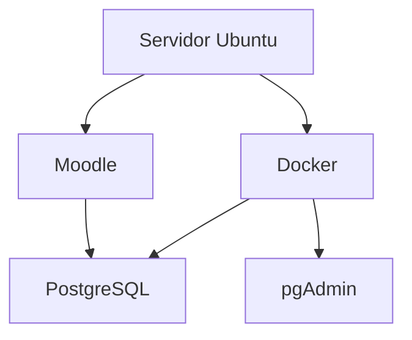
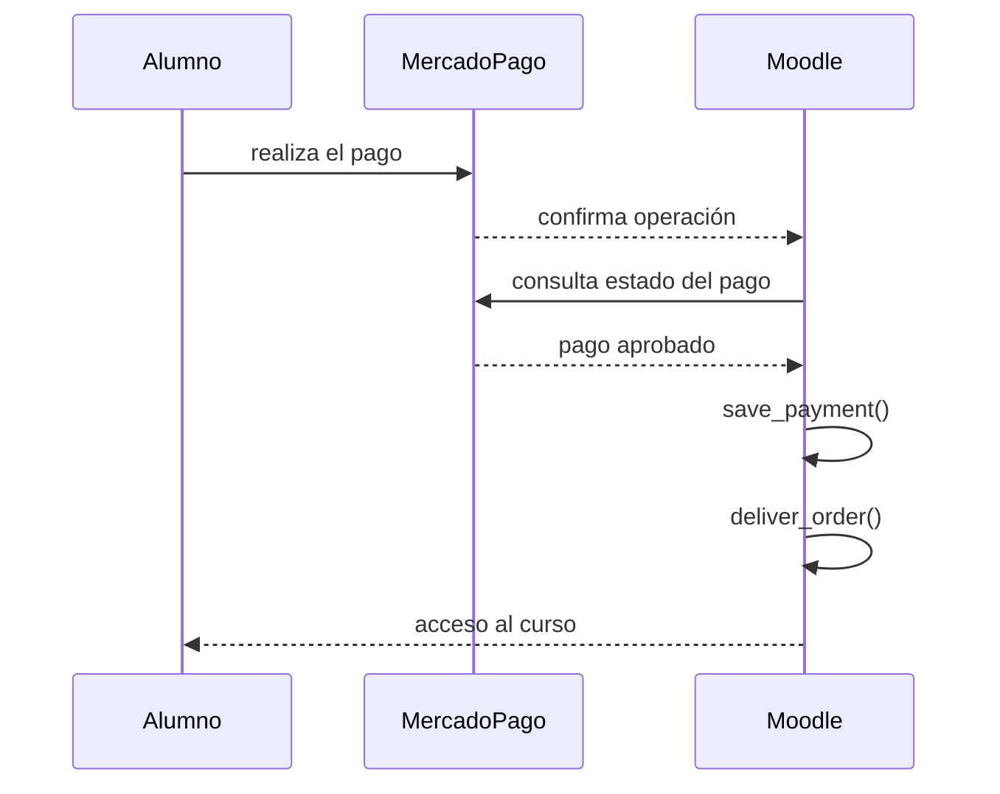

# Desarrollo del plugin Mercado Pago para Moodle

## Proyecto

Desarrollo de un gateway de pago para Moodle 5.2.1 utilizando Mercado Pago.

El objetivo es que un alumno pueda:

1. Registrarse en Moodle.
2. Pagar mediante Mercado Pago.
3. Confirmarse automáticamente el pago.
4. Matricularse automáticamente en el curso.
5. Acceder inmediatamente al contenido.

---

# Objetivos del proyecto

- Desarrollar un plugin nativo para Moodle.
- Compatible con Moodle 5.2.
- Código reutilizable.
- Publicable en GitHub.
- Documentación completa.
- Arquitectura mantenible.
- Utilizar únicamente APIs oficiales de Moodle y Mercado Pago.

---

# Forma de trabajo

Durante todo el desarrollo se seguirá la siguiente metodología:

- Un solo paso por vez.
- No avanzar hasta confirmar el paso.
- Documentar únicamente los pasos aceptados.
- Al finalizar generar una documentación completa en Markdown.
- Utilizar diagramas Mermaid.
- No utilizar emojis ni íconos.

---

# Entorno

## Sistema operativo

Ubuntu (DonWeb)

## Moodle

Versión:

```
5.2.1
(Build: 20260608)
```

## Código fuente

```
/home/portalpericial-campus/htdocs/campus.portalpericial.com.ar
```

## moodledata

```
/home/portalpericial-campus/htdocs/moodledata
```

## Base de datos

PostgreSQL 17

Ejecutándose en Docker.

## Administración

pgAdmin 9.16

Ejecutándose en Docker.

## Arquitectura



---

# Estructura detectada

Se verificó que la instalación utiliza la estructura moderna de Moodle 5.2.

```
campus.portalpericial.com.ar
│
├── admin
├── lib
├── public
├── scripts
├── config.php
├── composer.json
└── ...
```

Los gateways de pago se encuentran en:

```
public/payment/gateway
```

---

# Gateway oficial analizado

Se utilizó el gateway oficial de PayPal únicamente como referencia arquitectónica.

Ruta:

```
public/payment/gateway/paypal
```

Se analizaron los siguientes archivos:

```
classes/gateway.php
classes/paypal_helper.php
classes/external/get_config_for_js.php
classes/external/transaction_complete.php

db/install.php
db/install.xml
db/services.php

settings.php
version.php
```

No se copiará el código.

Se utilizará únicamente como referencia de diseño.

---

# Conclusiones obtenidas

## version.php

El componente del plugin deberá llamarse:

```
paygw_mercadopago
```

---

## gateway.php

Se confirmó que el gateway debe implementar:

- monedas soportadas
- formulario de configuración
- validación

---

## services.php

Los servicios AJAX se registran mediante:

```
db/services.php
```

---

## get_config_for_js.php

El gateway obtiene desde Moodle:

- componente
- paymentarea
- itemid
- importe
- moneda

---

## transaction_complete.php

Se confirmó el flujo oficial de Moodle.



También se confirmó que nunca debe confiarse en la información enviada por el navegador.

La validación debe hacerse consultando la API del proveedor de pagos.

---

## install.xml

Cada gateway posee una tabla propia.

PayPal almacena la relación:

```
paymentid
↓

pp_orderid
```

Nuestro plugin tendrá una tabla equivalente para Mercado Pago.

---

## paypal_helper.php

Se confirmó que Moodle utiliza su propia clase:

```
curl
```

No es obligatorio utilizar un SDK externo.

Se decidió utilizar directamente la API REST de Mercado Pago.

---

## settings.php

Los parámetros generales del gateway se agregan mediante:

```
core_payment\helper::add_common_gateway_settings()
```

---

## install.php

El gateway se registra automáticamente al instalarse.

---

# Decisiones de arquitectura

Se acordó que:

- No modificar el código de Moodle.
- Desarrollar un plugin independiente.
- Utilizar PHP.
- Utilizar la clase curl de Moodle.
- Utilizar la API REST de Mercado Pago.
- Confirmar todos los pagos mediante la API.
- Utilizar webhooks.
- Registrar los pagos mediante:

```
payment_helper::save_payment()
```

- Entregar el acceso mediante:

```
payment_helper::deliver_order()
```

---

# Estructura prevista del plugin

Todavía no implementada.

Se diseñará antes de comenzar a programar.

Propuesta inicial:

```text
paygw_mercadopago
│
├── classes
│   ├── gateway.php
│   ├── mercadopago_client.php
│   ├── payment_service.php
│   ├── webhook_service.php
│   ├── preference_service.php
│   └── external
│
├── db
│
├── lang
│
├── templates
│
├── pix
│
├── tests
│
├── version.php
│
└── settings.php
```

Esta estructura podrá ajustarse durante el diseño definitivo.

---

# VS Code

Se decidió abandonar el desarrollo exclusivamente por consola.

Se configuró:

- VS Code
- Remote SSH

Conexión exitosa al servidor.

Inicialmente se utilizó el usuario:

```
root
```

Posteriormente se configuró correctamente el acceso SSH para:

```
portalpericial-campus
```

utilizando autenticación mediante clave pública.

Se verificó que el acceso funciona correctamente.

A partir de este punto el desarrollo continuará utilizando VS Code conectado como:

```
portalpericial-campus
```

---

# Git

Se decidió que:

No se utilizará Git sobre toda la instalación de Moodle.

Cada plugin tendrá su propio repositorio independiente.

Esto permitirá:

- versionado independiente
- publicación en GitHub
- reutilización en otras instalaciones
- mantenimiento sencillo

---

# Estado actual

Se encuentra finalizada la etapa de investigación.

No se continuará inspeccionando archivos del core de Moodle.

En la siguiente etapa comenzará el diseño del plugin y posteriormente su implementación.

El siguiente paso será:

1. Inicializar Git para el plugin.
2. Diseñar la arquitectura definitiva.
3. Crear la estructura mínima del plugin.
4. Instalar el plugin en Moodle.
5. Comenzar el desarrollo funcional.

# Fase 1 - Validación final

## Registro del gateway en Moodle

Durante la implementación se verificó que el plugin era detectado e instalado correctamente por Moodle y que la tabla `paygw_mercadopago_transactions` se creaba sin inconvenientes.

Sin embargo, el gateway Mercado Pago no aparecía en la lista de portales de pago.

Luego de analizar el funcionamiento del subsistema `core_payment` se comprobó que Moodle utiliza la configuración `paygw_plugins_sortorder` para determinar los gateways habilitados.

Se implementó:

- `db/install.php` para registrar automáticamente el gateway en instalaciones nuevas.
- `db/upgrade.php` para registrar el gateway en instalaciones donde el plugin ya se encontraba instalado.

Se incrementó la versión del plugin a:

```php
$plugin->version = 2026071302;
```

Se ejecutó la actualización del plugin desde la administración de Moodle.

## Resultado de las pruebas

Se verificó correctamente que:

- Moodle detecta el plugin `paygw_mercadopago`.
- El plugin se instala sin errores.
- Se crea la tabla `paygw_mercadopago_transactions`.
- Moodle reconoce Mercado Pago como un gateway de pago.
- Mercado Pago aparece junto a PayPal en la pantalla **Administración del sitio → General → Pagos → Cuentas para pago**.

Con esta validación se considera finalizada la **Fase 1 – Esqueleto del plugin** y se da inicio a la **Fase 2 – Configuración del gateway**.
