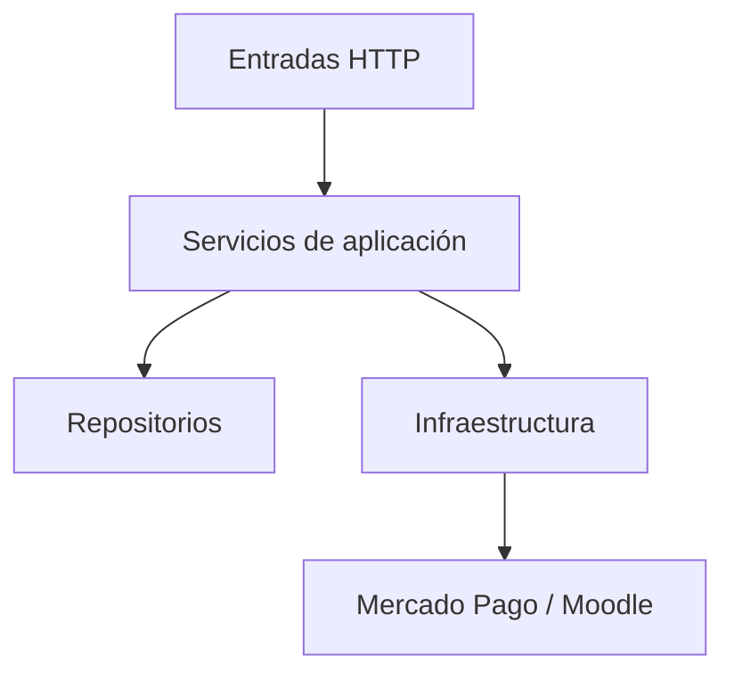
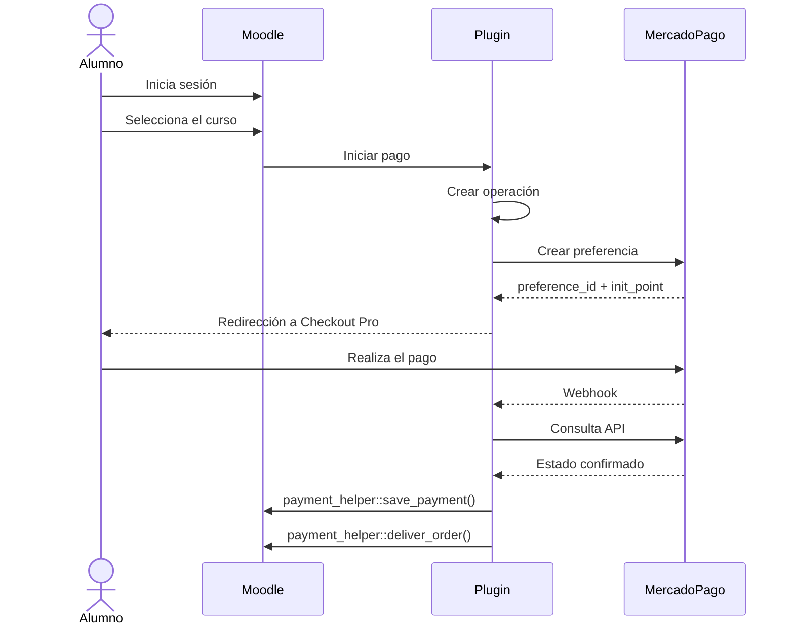
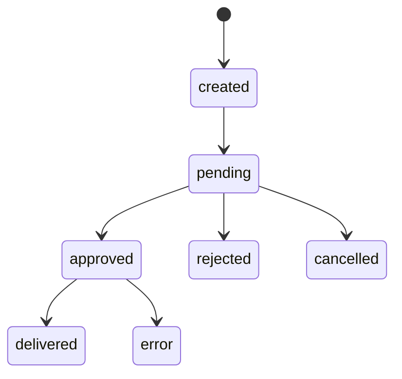

# 03 - Arquitectura (Parte 1)

## Plugin: paygw_mercadopago

### Estado del documento

Aprobado.

---

# 1. Introducción

Este documento describe la arquitectura del plugin **paygw_mercadopago** para Moodle 5.2.1.

El objetivo del plugin es integrar Mercado Pago como gateway de pago utilizando el subsistema oficial de pagos de Moodle, sin modificar el core y utilizando únicamente las APIs públicas provistas por la plataforma.

Durante el diseño se tomó como referencia conceptual el gateway oficial de PayPal de Moodle para comprender el funcionamiento del subsistema de pagos. No se reutilizará código del plugin PayPal; la implementación será completamente propia.

---

# 2. Objetivos

El plugin deberá permitir:

- Configurar credenciales de Mercado Pago.
- Crear preferencias de pago.
- Redirigir al alumno a Checkout Pro.
- Recibir notificaciones mediante Webhooks.
- Confirmar los pagos consultando la API de Mercado Pago.
- Registrar el pago mediante `payment_helper::save_payment()`.
- Entregar automáticamente la compra mediante `payment_helper::deliver_order()`.

---

# 3. Alcance

El plugin será responsable únicamente de la integración entre Moodle y Mercado Pago.

## Incluye

- Configuración del gateway.
- Creación de preferencias.
- Recepción de Webhooks.
- Confirmación de pagos.
- Registro del pago.
- Entrega automática del pedido.
- Auditoría de transacciones.
- Logging.

## No incluye

- Gestión de usuarios.
- Gestión de cursos.
- Matrículas manuales.
- Cálculo de importes.
- Reembolsos.
- Checkout propio.
- Modificaciones al core de Moodle.

---

# 4. Principios de diseño

Durante el desarrollo se adoptan los siguientes principios.

## Independencia del core

El plugin no modificará archivos del núcleo de Moodle.

## Responsabilidad única

Cada clase tendrá una única responsabilidad.

## Separación de capas

La lógica de negocio permanecerá separada de:

- HTTP
- Base de datos
- Mercado Pago
- Moodle

## Confirmación segura

Nunca se confiará únicamente en el retorno del navegador.

Todo pago será confirmado mediante la API oficial de Mercado Pago.

## Uso de Webhooks

Las notificaciones serán el mecanismo principal para detectar cambios de estado.

## Idempotencia

Una operación sólo podrá entregarse una vez.

---

# 5. Arquitectura general

```mermaid
flowchart LR

A[Alumno]

A --> B[Moodle]

B --> C[Plugin Mercado Pago]

C --> D[Mercado Pago]

D --> E[Webhook]

E --> C

C --> F[Core Payment]

F --> G[payment_helper::save_payment()]

F --> H[payment_helper::deliver_order()]
```

El plugin actúa como intermediario entre Moodle y Mercado Pago.

Toda la lógica de integración permanecerá encapsulada dentro del plugin.

---

# 6. Arquitectura por capas

El diseño se organiza en cinco capas.



Cada capa conoce únicamente la inmediatamente inferior.

---

# 7. Decisión 1 - Arquitectura por capas

Se adopta una arquitectura por capas.

Las responsabilidades quedan separadas en:

- Entradas HTTP.
- Servicios de aplicación.
- Integración con Mercado Pago.
- Integración con Moodle.
- Persistencia.

## Beneficios

- Bajo acoplamiento.
- Alta cohesión.
- Facilidad de pruebas.
- Facilidad de mantenimiento.

---

# 8. Decisión 2 - Límites del plugin

## El plugin será responsable de

- Configuración.
- Creación de preferencias.
- Recepción de Webhooks.
- Confirmación de pagos.
- Registro de transacciones.
- Registro del pago en Moodle.
- Entrega automática del pedido.
- Auditoría.
- Logging.

## El plugin no será responsable de

- Administración de usuarios.
- Administración de cursos.
- Matrículas manuales.
- Cálculo de importes.
- Gestión de reembolsos.
- Checkout propio.
- Modificaciones del core.

## Dependencias

El plugin dependerá únicamente de:

- APIs públicas de Moodle.
- API REST de Mercado Pago.
- API de base de datos de Moodle.
- Clase `curl` de Moodle.

No utilizará SDKs oficiales ni librerías externas.

---

# 9. Decisión 3 - Flujo principal del pago



## Reglas

- El usuario debe estar autenticado.
- El importe proviene de Moodle.
- Se crea primero una operación local.
- El navegador no confirma pagos.
- Todo pago se valida mediante la API de Mercado Pago.

---

# 10. Decisión 4 - Estados de la transacción



Estados definidos:

- created
- pending
- approved
- rejected
- cancelled
- refunded
- error
- delivered

## Regla

El estado **approved** no implica que el pedido haya sido entregado.

La entrega sólo ocurre después de ejecutar:

- `payment_helper::save_payment()`
- `payment_helper::deliver_order()`

---

# 11. Decisión 5 - Estructura física del plugin

El plugin seguirá la estructura estándar de Moodle.

```text
paygw_mercadopago/

├── amd/
├── classes/
├── db/
├── lang/
├── tests/
├── webhook.php
├── return.php
├── version.php
├── settings.php
├── lib.php
└── README.md
```

Dentro de `classes` los componentes se organizarán por responsabilidad.

```text
classes/

└── local/

    ├── client/

    ├── repository/

    ├── service/

    ├── validation/

    └── moodle/
```

## Objetivos de esta organización

- Separación clara de responsabilidades.
- Escalabilidad.
- Facilidad de mantenimiento.
- Integración natural con Moodle.

---

**Fin de la Parte 1**