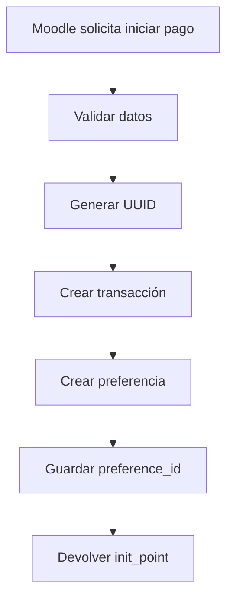
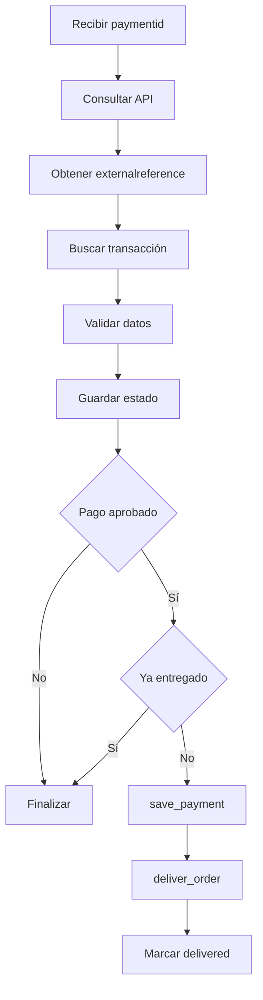
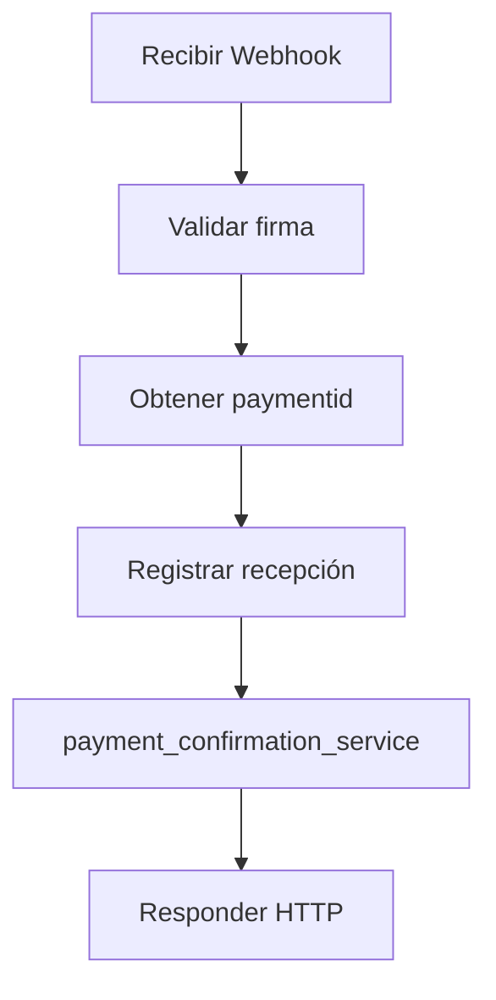

# 03 - Arquitectura (Parte 2)

## Plugin: paygw_mercadopago

### Estado del documento

Aprobado.

---

# Índice

1. Modelo de persistencia
2. Decisión 6 - Tabla de transacciones
3. Decisión 7 - External Reference
4. Decisión 8 - Payment Service
5. Decisión 9 - Payment Confirmation Service
6. Decisión 10 - Webhook Service

---

# 1. Modelo de persistencia

El plugin mantendrá una tabla propia para registrar todas las operaciones realizadas con Mercado Pago.

Esta tabla no reemplaza las tablas del subsistema de pagos de Moodle. Su finalidad es permitir:

- Trazabilidad.
- Auditoría.
- Idempotencia.
- Recuperación ante errores.
- Correlación entre Moodle y Mercado Pago.

La tabla será creada mediante el mecanismo estándar de Moodle.

El nombre lógico será:

```text
paygw_mercadopago_transactions
```

El nombre físico dependerá del prefijo configurado en la instalación de Moodle.

Por ejemplo:

```text
mdl_paygw_mercadopago_transactions
```

El plugin nunca asumirá que el prefijo es `mdl_`. Todas las operaciones se realizarán utilizando la API de base de datos de Moodle.

---

# 2. Decisión 6 - Tabla de transacciones

La tabla almacenará la información necesaria para relacionar una operación de Moodle con una operación de Mercado Pago.

## Campos principales

| Campo | Descripción |
|--------|-------------|
| id | Identificador interno |
| userid | Usuario de Moodle |
| accountid | Cuenta de pago |
| component | Componente que inicia el pago |
| paymentarea | Área de pago |
| itemid | Identificador del concepto |
| amount | Importe esperado |
| currency | Moneda |
| externalreference | Identificador único enviado a Mercado Pago |
| preferenceid | Identificador de la preferencia |
| paymentid | Identificador del pago |
| internalstatus | Estado interno del plugin |
| externalstatus | Estado informado por Mercado Pago |
| delivered | Indica si la operación ya fue entregada |
| attempts | Cantidad de intentos de procesamiento |
| lasterror | Último error registrado |
| timecreated | Fecha de creación |
| timemodified | Fecha de última modificación |
| timeapproved | Fecha de aprobación |
| timedelivered | Fecha de entrega |

## Restricciones

- `externalreference` será único.
- `paymentid` será único cuando exista.
- `delivered` iniciará en `0`.
- `attempts` iniciará en `0`.
- `internalstatus` iniciará en `created`.

## Índices

Se crearán índices sobre:

- userid
- accountid
- externalreference
- preferenceid
- paymentid
- internalstatus

---

# 3. Decisión 7 - External Reference

Cada operación tendrá un identificador único generado por el plugin.

Se utilizará un UUID versión 4.

Ejemplo:

```text
8d5b76d7-52d3-47d4-aed3-9d7c0b92d5cf
```

Este valor será enviado a Mercado Pago mediante el campo:

```text
external_reference
```

Cuando el plugin consulte la API de Mercado Pago utilizará ese valor para localizar la operación correspondiente.

## Objetivos

- Evitar exponer información interna.
- Evitar colisiones.
- Permitir múltiples pagos del mismo usuario.
- Mantener independencia respecto del modelo interno.

Los identificadores propios de Moodle permanecerán almacenados únicamente en la base de datos del plugin.

---

# 4. Decisión 8 - Payment Service

`payment_service` será el responsable de iniciar una operación de pago.

## Flujo



## Responsabilidades

- Validar la información recibida.
- Generar el UUID.
- Crear la operación local.
- Solicitar la creación de la preferencia.
- Guardar el `preferenceid`.
- Cambiar el estado a `pending`.
- Devolver la URL de Checkout Pro.

## No será responsable de

- Confirmar pagos.
- Procesar Webhooks.
- Registrar pagos.
- Entregar pedidos.
- Acceder directamente a la base de datos.

## Dependencias

Conocerá únicamente:

- transaction_repository
- mercadopago_client

---

# 5. Decisión 9 - Payment Confirmation Service

`payment_confirmation_service` será el único componente autorizado para confirmar un pago.

## Flujo



## Responsabilidades

- Consultar Mercado Pago.
- Validar la referencia.
- Validar importe y moneda.
- Actualizar estados.
- Verificar idempotencia.
- Registrar el pago.
- Entregar el pedido.
- Registrar errores.

## Dependencias

- mercadopago_client
- transaction_repository
- payment_adapter

## Regla

La única fuente válida para confirmar un pago será la respuesta obtenida desde la API oficial de Mercado Pago.

---

# 6. Decisión 10 - Webhook Service

`webhook_service` coordinará el procesamiento de las notificaciones.

## Flujo



## Responsabilidades

- Validar la autenticidad del Webhook.
- Obtener el identificador del pago.
- Rechazar notificaciones inválidas.
- Delegar la confirmación.
- Finalizar el procesamiento.

## No será responsable de

- Consultar Mercado Pago.
- Registrar pagos.
- Entregar pedidos.
- Acceder directamente a la base de datos.

## Dependencias

- webhook_signature_validator
- payment_confirmation_service

## Regla

Toda la lógica de confirmación permanecerá concentrada en `payment_confirmation_service`.

---

**Fin de la Parte 2**