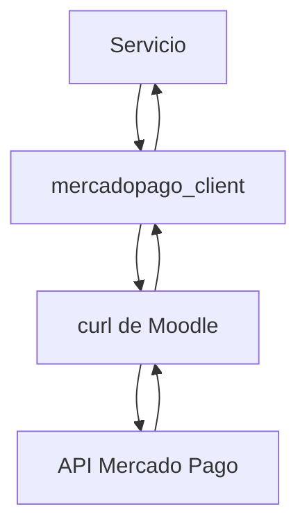
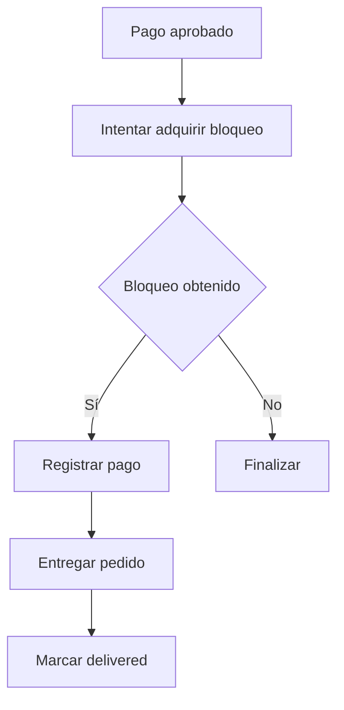

# 03 - Arquitectura (Parte 3)

## Plugin: paygw_mercadopago

### Estado del documento

Aprobado.

---

# Índice

1. Decisión 11 - Mercado Pago Client
2. Decisión 12 - Transaction Repository
3. Decisión 13 - Modelo de excepciones
4. Decisión 14 - Estrategia de logging
5. Decisión 15 - Concurrencia e idempotencia

---

# 1. Decisión 11 - Mercado Pago Client

`mercadopago_client` será el único componente responsable de comunicarse con la API de Mercado Pago.

## Arquitectura



## Responsabilidades

- Construir solicitudes HTTP.
- Agregar la autenticación mediante Access Token.
- Enviar solicitudes utilizando la clase `curl` de Moodle.
- Procesar respuestas HTTP.
- Interpretar respuestas JSON.
- Crear preferencias de pago.
- Consultar pagos existentes.
- Detectar errores de comunicación.

## Operaciones principales

### Crear preferencia

La operación deberá enviar la información necesaria para generar una preferencia de Checkout Pro.

Como resultado devolverá, como mínimo:

- preferenceid
- initpoint

### Consultar pago

La operación recibirá el identificador del pago y devolverá, como mínimo:

- paymentid
- status
- statusdetail
- externalreference
- transactionamount
- currencyid
- dateapproved
- payeremail

Los servicios del plugin trabajarán únicamente con estos datos normalizados.

## No será responsable de

- Acceder a la base de datos.
- Confirmar pagos.
- Registrar pagos.
- Entregar pedidos.
- Procesar Webhooks.
- Mostrar mensajes al usuario.

## Regla

Todo acceso a la API de Mercado Pago deberá realizarse exclusivamente a través de esta clase.

---

# 2. Decisión 12 - Transaction Repository

`transaction_repository` será la única puerta de acceso a la tabla de transacciones.

Toda operación de lectura o escritura será realizada mediante la API de base de datos de Moodle.

## Responsabilidades

- Crear transacciones.
- Buscar transacciones.
- Actualizar estados.
- Guardar el Preference ID.
- Guardar el Payment ID.
- Registrar errores.
- Incrementar intentos.
- Marcar una operación como entregada.

## Operaciones conceptuales

- create()
- find_by_id()
- find_by_external_reference()
- find_by_payment_id()
- save_preference()
- save_payment_reference()
- update_status()
- register_error()
- mark_as_delivered()

## No será responsable de

- Aplicar reglas de negocio.
- Confirmar pagos.
- Consultar Mercado Pago.
- Ejecutar `payment_helper::save_payment()`.
- Ejecutar `payment_helper::deliver_order()`.

## Regla

Toda la lógica de persistencia permanecerá concentrada en esta clase.

---

# 3. Decisión 13 - Modelo de excepciones

El plugin utilizará excepciones para comunicar errores entre capas.

No se utilizarán valores booleanos para indicar errores de negocio.

## Jerarquía conceptual

```text
PaymentException

├── InvalidConfigurationException
├── InvalidWebhookException
├── MercadoPagoApiException
├── PaymentNotFoundException
├── InvalidPaymentStatusException
├── DuplicatePaymentException
└── MoodlePaymentException
```

## Objetivos

- Separar errores de negocio de errores técnicos.
- Evitar comprobaciones repetidas mediante valores booleanos.
- Centralizar el tratamiento de errores.

## Regla

Cada capa lanzará excepciones propias.

La capa superior decidirá cómo responder frente a cada situación.

---

# 4. Decisión 14 - Estrategia de logging

El plugin utilizará el sistema de logging de Moodle.

No se crearán archivos de log propios.

## Eventos a registrar

- Inicio de una operación.
- Creación de la preferencia.
- Respuesta de Mercado Pago.
- Recepción de un Webhook.
- Validación de la firma.
- Consulta de un pago.
- Cambio de estado.
- Registro del pago.
- Entrega del pedido.
- Excepciones y errores.

## Identificador de correlación

Todos los registros utilizarán:

```text
externalreference
```

como identificador común de la transacción.

## Información sensible

No se registrarán:

- Access Token.
- Secretos del Webhook.
- Firmas.
- Credenciales.

## Niveles

- DEBUG
- INFO
- WARNING
- ERROR

## Regla

Todo evento relevante del ciclo de vida de una transacción deberá quedar registrado mediante el sistema estándar de Moodle.

---

# 5. Decisión 15 - Concurrencia e idempotencia

El plugin garantizará que una operación sólo pueda entregarse una vez.

## Flujo



## Principios

La entrega será realizada únicamente por:

```text
payment_confirmation_service
```

El control de concurrencia será responsabilidad de:

```text
transaction_repository
```

## Reglas

Antes de registrar el pago y entregar el pedido deberá obtenerse un bloqueo que garantice que otro proceso no está ejecutando la misma operación.

Los siguientes escenarios deberán resolverse correctamente:

- Webhooks duplicados.
- Reintentos automáticos.
- Recarga del navegador.
- Procesamiento simultáneo.

## Resultado esperado

Una operación podrá ser confirmada múltiples veces, pero sólo será entregada una única vez.

---

**Fin de la Parte 3**