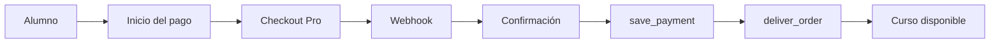

# 03 - Arquitectura (Parte 4)

## Plugin: paygw_mercadopago

### Estado del documento

Aprobado.

---

# Índice

1. Decisión 16 - Configuración del gateway
2. Decisión 17 - Respuestas HTTP del Webhook
3. Decisión 18 - Return
4. Decisión 19 - Convenciones de desarrollo
5. Decisión 20 - Estrategia de pruebas

---

# 1. Decisión 16 - Configuración del gateway

Las credenciales de Mercado Pago se configurarán por cada cuenta de pago de Moodle.

No existirán credenciales globales compartidas.

## Configuración

Cada cuenta de pago dispondrá de los siguientes parámetros:

| Parámetro | Descripción |
|-----------|-------------|
| enabled | Habilita el gateway |
| environment | Sandbox o Production |
| accesstoken | Access Token de Mercado Pago |
| webhooksecret | Secreto utilizado para validar Webhooks |

## Configuración global

Inicialmente el plugin no requerirá parámetros globales.

## Reglas

- El Access Token nunca será enviado al navegador.
- No se almacenará en la tabla de transacciones.
- No aparecerá en los logs.
- Las URL técnicas serán generadas automáticamente por el plugin.

---

# 2. Decisión 17 - Respuestas HTTP del Webhook

El endpoint responderá utilizando códigos HTTP de acuerdo con el resultado técnico del procesamiento.

## Respuestas

| Código | Significado |
|---------|-------------|
| 200 | Notificación procesada correctamente |
| 200 | Pago ya procesado |
| 400 | Solicitud inválida |
| 401 | Firma inválida |
| 404 | Operación inexistente |
| 500 | Error interno |

## Regla

Los estados comerciales del pago no determinan el código HTTP.

Un pago pendiente, rechazado o cancelado responderá igualmente con **200 OK** cuando la notificación haya sido procesada correctamente.

---

# 3. Decisión 18 - Return

`return.php` será una página exclusivamente informativa.

No tendrá responsabilidades de negocio.

## Responsabilidades

- Verificar que el usuario se encuentre autenticado.
- Identificar la operación correspondiente.
- Consultar el estado registrado localmente.
- Mostrar el resultado al usuario.

## Estados posibles

- delivered
- approved
- pending
- rejected
- cancelled
- error

## No será responsable de

- Confirmar pagos.
- Registrar pagos.
- Entregar pedidos.
- Modificar estados.

## Regla

La información mostrada siempre se obtendrá desde el estado registrado por el plugin.

Nunca se confiará en parámetros recibidos desde el navegador.

---

# 4. Decisión 19 - Convenciones de desarrollo

El plugin seguirá las convenciones habituales de Moodle.

## Organización

Todas las clases pertenecerán al namespace del plugin.

La organización será:

```text
paygw_mercadopago

└── local

    ├── client

    ├── repository

    ├── service

    ├── validation

    └── moodle
```

## Convenciones

- Tipado estricto.
- Tipos de retorno.
- Inyección de dependencias.
- Separación de responsabilidades.

## Regla

El código nuevo respetará las convenciones de Moodle para facilitar el mantenimiento y la integración con el ecosistema.

---

# 5. Decisión 20 - Estrategia de pruebas

El desarrollo será incremental.

Cada etapa deberá verificarse antes de continuar con la siguiente.

## Tipos de pruebas

### Unitarias

Validarán cada componente de forma aislada.

### Integración

Validarán la comunicación con:

- Moodle.
- PostgreSQL.
- Mercado Pago Sandbox.

### Funcionales

Validarán el flujo completo de compra.



## Casos mínimos

- Pago aprobado.
- Pago pendiente.
- Pago rechazado.
- Webhook duplicado.
- Firma inválida.
- Pago inexistente.
- Error de Mercado Pago.
- Error durante save_payment().
- Error durante deliver_order().

## Regla

No se avanzará a la siguiente etapa hasta validar correctamente la anterior.

---

**Fin de la Parte 4**