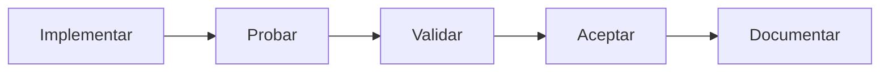

# 03 - Arquitectura (Parte 5)

## Plugin: paygw_mercadopago

### Estado del documento

Aprobado.

---

# Índice

1. Decisión 21 - Orden de implementación
2. Roadmap de desarrollo
3. Resumen de decisiones aprobadas

---

# 1. Decisión 21 - Orden de implementación

El desarrollo del plugin se realizará de forma incremental.

Cada etapa deberá encontrarse completamente implementada y validada antes de comenzar la siguiente.

## Fase 1 - Esqueleto del plugin

Objetivo:

Crear la estructura mínima para que Moodle detecte e instale el plugin.

Archivos iniciales:

- version.php
- lib.php
- classes/gateway.php
- db/install.xml
- lang/en/paygw_mercadopago.php
- lang/es/paygw_mercadopago.php

Resultado esperado:

- El plugin instala correctamente.
- Moodle reconoce el nuevo gateway.

---

## Fase 2 - Configuración

Objetivo:

Implementar la configuración del gateway para cada cuenta de pago.

Resultado esperado:

- Las credenciales pueden configurarse y guardarse correctamente.

---

## Fase 3 - Persistencia

Objetivo:

Implementar la tabla de transacciones y el repositorio.

Componentes:

- transaction_repository
- install.xml

Resultado esperado:

- Crear transacciones.
- Buscar transacciones.
- Actualizar estados.
- Registrar errores.

---

## Fase 4 - Cliente Mercado Pago

Objetivo:

Implementar la comunicación con la API.

Componentes:

- mercadopago_client

Resultado esperado:

- Crear preferencias.
- Consultar pagos.
- Manejar errores de comunicación.

Las pruebas se realizarán utilizando el entorno Sandbox de Mercado Pago.

---

## Fase 5 - Inicio del pago

Objetivo:

Implementar el inicio completo de una operación.

Componentes:

- payment_service

Resultado esperado:

- Crear la transacción.
- Crear la preferencia.
- Obtener el init_point.
- Redirigir al usuario.

---

## Fase 6 - Webhooks

Objetivo:

Procesar correctamente las notificaciones.

Componentes:

- webhook.php
- webhook_service
- webhook_signature_validator

Resultado esperado:

- Validar la firma.
- Obtener el Payment ID.
- Delegar la confirmación.

---

## Fase 7 - Confirmación del pago

Objetivo:

Confirmar definitivamente la operación.

Componentes:

- payment_confirmation_service
- payment_adapter

Resultado esperado:

- Consultar la API.
- Registrar el pago.
- Ejecutar:

  - payment_helper::save_payment()
  - payment_helper::deliver_order()

---

## Fase 8 - Return

Objetivo:

Mostrar correctamente el estado de la operación al usuario.

Componente:

- return.php

Resultado esperado:

- Mostrar el estado registrado localmente.
- No modificar información.

---

## Fase 9 - Validación final

Objetivo:

Verificar el funcionamiento integral del plugin.

Se validará:

- Flujo completo de pago.
- Idempotencia.
- Logging.
- Manejo de excepciones.
- Concurrencia.
- Integración con Moodle.
- Integración con Mercado Pago.

---

# 2. Roadmap de desarrollo

El desarrollo seguirá siempre el mismo ciclo.

Cada componente será incorporado únicamente cuando:

- tenga una responsabilidad completa;
- pueda probarse;
- funcione correctamente.

No se implementarán componentes parcialmente terminados.

---

# 3. Resumen de decisiones aprobadas

## Arquitectura

1. Arquitectura por capas.
2. Límites del plugin.
3. Flujo principal del pago.
4. Estados de la transacción.
5. Estructura física.

## Persistencia

6. Tabla de transacciones.
7. External Reference mediante UUID.

## Servicios

8. payment_service.
9. payment_confirmation_service.
10. webhook_service.
11. mercadopago_client.
12. transaction_repository.

## Infraestructura

13. Modelo de excepciones.
14. Estrategia de logging.
15. Concurrencia e idempotencia.

## Configuración

16. Configuración por cuenta de pago.

## Interfaces

17. Respuestas HTTP del Webhook.
18. return.php.

## Desarrollo

19. Convenciones de desarrollo.
20. Estrategia de pruebas.
21. Orden de implementación.

---

# Cierre de la etapa de arquitectura

Con este documento finaliza la etapa de diseño arquitectónico del plugin **paygw_mercadopago**.

A partir de este punto no se incorporarán nuevas decisiones de arquitectura durante la implementación. El desarrollo comenzará siguiendo el orden establecido en este documento y cualquier cambio futuro deberá evaluarse como una modificación de la arquitectura existente.

---

**Fin de la Parte 5**