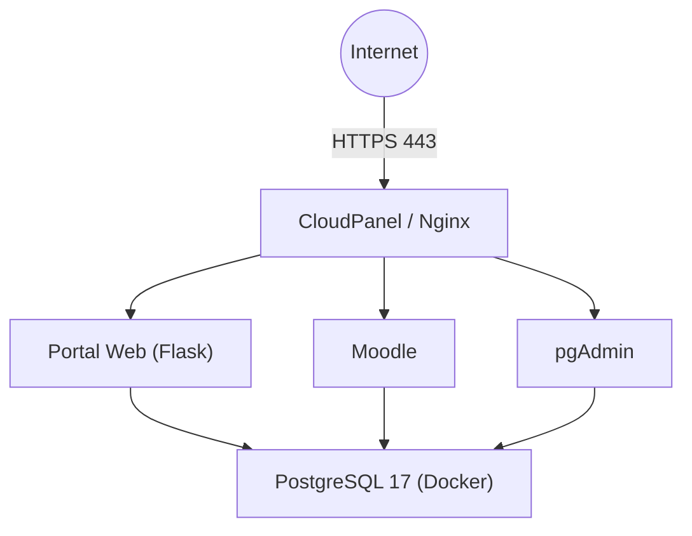

# 01. Infraestructura del Servidor

**Proyecto:** Portal Pericial  
**Versión:** 1.0  
**Última actualización:** 12/07/2026

---

# Índice

1. Objetivo
2. Especificaciones del servidor
3. Arquitectura general
4. Componentes
5. Organización del servidor
6. Decisiones de arquitectura
7. Servicios publicados
8. Estado actual
9. Buenas prácticas
10. Referencias

---

# 1. Objetivo

Este documento describe la arquitectura general del servidor utilizado por el proyecto **Portal Pericial**.

Su propósito es documentar las decisiones de diseño adoptadas para que la infraestructura pueda mantenerse, ampliarse o reconstruirse sin depender de conocimientos previos.

Los procedimientos detallados de instalación se encuentran en los documentos específicos de cada componente.

---

# 2. Especificaciones del servidor

| Concepto | Valor |
|----------|-------|
| Proveedor | DonWeb |
| Tipo | Cloud Server |
| Sistema Operativo | Ubuntu 24.04 LTS |
| CPU | 4 vCPU |
| Memoria | 4 GB RAM |
| Disco | 30 GB SSD |
| IP pública | 149.50.152.230 |

---

# 3. Arquitectura general



Toda comunicación externa ingresa por HTTPS y es administrada por CloudPanel.

PostgreSQL permanece aislado dentro de Docker y no acepta conexiones externas.

---

# 4. Componentes

| Componente | Función |
|------------|---------|
| Ubuntu 24.04 LTS | Sistema operativo |
| CloudPanel | Administración de sitios y certificados |
| Nginx | Servidor web |
| PHP 8.4 | Ejecución de Moodle |
| Docker | Contenedores |
| Docker Compose | Orquestación de contenedores |
| PostgreSQL 17 | Base de datos |
| pgAdmin 4 | Administración de PostgreSQL |
| Moodle | Plataforma educativa |
| Flask | Aplicaciones propias |

---

# 5. Organización del servidor

## Sitios

| Dominio | Función |
|----------|---------|
| https://portalpericial.com.ar | Portal principal |
| https://campus.portalpericial.com.ar | Moodle |
| https://pgadmin.portalpericial.com.ar | Administración PostgreSQL |
| https://cloudpanel.portalpericial.com.ar:8443 | Administración del servidor |

---

## Organización de directorios

```text
/
├── opt
│   └── postgresql
│       ├── .env
│       ├── docker-compose.yml
│       └── docker-compose.yml.bak
│
├── home
│   └── portalpericial-campus
│       └── htdocs
│           └── campus.portalpericial.com.ar
│
└── ...
```

---

# 6. Decisiones de arquitectura

## CloudPanel

CloudPanel administra:

- Nginx
- PHP
- Virtual Hosts
- Certificados Let's Encrypt
- Reverse Proxy

---

## Docker

Docker administra exclusivamente los servicios persistentes.

Actualmente:

- PostgreSQL
- pgAdmin

Esto permite actualizar o recrear los contenedores sin afectar el sistema operativo.

---

## PostgreSQL

Se utiliza una única instancia de PostgreSQL.

Cada aplicación tendrá su propia base de datos y, en el futuro, su propio usuario.

Actualmente:

- moodle

Previstas:

- portalpericial
- healthcare360
- otras aplicaciones

---

## Moodle

Moodle se ejecuta directamente sobre Ubuntu utilizando PHP administrado por CloudPanel.

No se ejecuta dentro de Docker.

---

## Flask

Las aplicaciones Flask se ejecutarán directamente sobre Ubuntu utilizando Gunicorn.

Compartirán la misma instancia de PostgreSQL, pero cada una utilizará su propia base de datos.

---

# 7. Servicios publicados

| Servicio | Puerto | Observaciones |
|----------|--------|---------------|
| HTTP | 80 | Redirección a HTTPS |
| HTTPS | 443 | Sitios públicos |
| SSH | 5650 | Administración remota |

Los siguientes servicios **no** se encuentran publicados:

| Servicio | Acceso |
|----------|--------|
| PostgreSQL | 127.0.0.1:5432 |
| pgAdmin | 127.0.0.1:5050 |

Ambos permanecen accesibles únicamente desde el propio servidor.

---

# 8. Estado actual

Actualmente la infraestructura dispone de:

- CloudPanel operativo.
- Docker operativo.
- PostgreSQL 17 en Docker.
- pgAdmin 4 en Docker.
- Moodle conectado a PostgreSQL.
- Certificados Let's Encrypt.
- Acceso SSH mediante claves Ed25519.
- PostgreSQL restringido a localhost.
- pgAdmin publicado mediante Reverse Proxy.

---

# 9. Buenas prácticas

- Mantener PostgreSQL aislado de Internet.
- Publicar únicamente servicios HTTPS.
- Utilizar Docker para servicios persistentes.
- Mantener la configuración documentada.
- Realizar respaldos antes de cualquier modificación importante.
- Evitar cambios manuales fuera de la documentación.

---

# 10. Referencias

- 02-CloudPanel.md
- 03-Docker.md
- 04-PostgreSQL.md
- 05-pgAdmin.md
- 06-Moodle.md
- 07-Seguridad.md