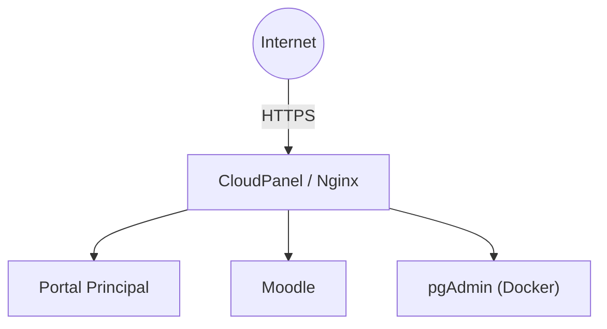

# 02. CloudPanel

**Proyecto:** Portal Pericial  
**Versión:** 1.0  
**Última actualización:** 12/07/2026

---

# Índice

1. Objetivo
2. Arquitectura
3. Instalación
4. Sitios configurados
5. Configuración de Moodle
6. Reverse Proxy
7. Certificados SSL
8. DNS
9. Problemas encontrados
10. Buenas prácticas
11. Referencias

---

# 1. Objetivo

CloudPanel es el panel de administración utilizado para gestionar los servicios web del servidor.

Sus responsabilidades son:

- Administración de sitios web.
- Configuración de Nginx.
- Administración de PHP.
- Gestión de certificados Let's Encrypt.
- Configuración de Reverse Proxy.
- Administración de Virtual Hosts.

CloudPanel **no administra PostgreSQL**, ya que la base de datos se ejecuta dentro de Docker.

---

# 2. Arquitectura



CloudPanel recibe todas las conexiones HTTPS y las dirige al servicio correspondiente.

---

# 3. Instalación

Sistema operativo utilizado:

| Concepto | Valor |
|----------|-------|
| Distribución | Ubuntu 24.04 LTS |
| Panel | CloudPanel |

La instalación se realizó siguiendo la documentación oficial de CloudPanel.

Una vez finalizada, el panel quedó disponible en:

```
https://cloudpanel.portalpericial.com.ar:8443
```

---

# 4. Sitios configurados

## Portal Principal

| Parámetro | Valor |
|-----------|-------|
| Dominio | portalpericial.com.ar |
| Tipo | PHP |
| Uso | Aplicaciones Flask (futuro) |

---

## Moodle

| Parámetro | Valor |
|-----------|-------|
| Dominio | campus.portalpericial.com.ar |
| Tipo | PHP |
| Versión PHP | 8.4 |

---

## pgAdmin

| Parámetro | Valor |
|-----------|-------|
| Dominio | pgadmin.portalpericial.com.ar |
| Tipo | Reverse Proxy |
| Destino | http://127.0.0.1:5050 |

---

# 5. Configuración de Moodle

Durante la instalación se produjo un error HTTP 500.

La causa fue un **Document Root incorrecto**.

Inicialmente CloudPanel apuntaba al directorio:

```text
/home/portalpericial-campus/htdocs/campus.portalpericial.com.ar
```

El código de Moodle se encontraba dentro de:

```text
public
```

Por lo tanto se modificó el Document Root para apuntar a:

```text
/home/portalpericial-campus/htdocs/campus.portalpericial.com.ar/public
```

Después de realizar el cambio el instalador comenzó a funcionar correctamente.

---

# 6. Reverse Proxy

Para publicar pgAdmin se creó un sitio de tipo **Reverse Proxy**.

Configuración utilizada:

| Parámetro | Valor |
|-----------|-------|
| Dominio | pgadmin.portalpericial.com.ar |
| Destino | http://127.0.0.1:5050 |

De esta manera:

- pgAdmin no queda expuesto directamente.
- El puerto 5050 permanece accesible únicamente desde localhost.
- Todo el tráfico externo utiliza HTTPS.

---

# 7. Certificados SSL

Los certificados fueron emitidos mediante **Let's Encrypt**.

CloudPanel administra automáticamente:

- Solicitud del certificado.
- Instalación.
- Renovación.

No es necesario administrar manualmente los certificados.

---

# 8. DNS

Se configuraron los siguientes registros tipo **A**:

| Dominio | Destino |
|----------|---------|
| portalpericial.com.ar | 149.50.152.230 |
| campus.portalpericial.com.ar | 149.50.152.230 |
| pgadmin.portalpericial.com.ar | 149.50.152.230 |
| cloudpanel.portalpericial.com.ar | 149.50.152.230 |

La propagación se verificó mediante:

```
https://www.whatsmydns.net
```

---

# 9. Problemas encontrados

## Error HTTP 500 en Moodle

**Causa**

Document Root incorrecto.

**Solución**

Modificar el Document Root para apuntar al directorio `public`.

---

## Error PHP PGSQL

**Causa**

La extensión PostgreSQL para PHP no estaba instalada.

**Solución**

```bash
sudo apt update
sudo apt install php8.4-pgsql
sudo systemctl restart php8.4-fpm
```

---

## ERR_NAME_NOT_RESOLVED

**Causa**

No existía el registro DNS del subdominio `pgadmin`.

**Solución**

Crear el registro tipo A correspondiente y esperar la propagación.

---

## Chrome mostraba "No seguro"

**Causa**

Política HSTS almacenada localmente en el navegador.

**Solución**

Eliminar la política HSTS del dominio y volver a acceder al sitio.

---

# 10. Buenas prácticas

- Utilizar siempre HTTPS.
- Mantener CloudPanel actualizado.
- No modificar manualmente archivos de configuración generados por CloudPanel salvo que sea necesario.
- Verificar el estado de los certificados después de agregar nuevos dominios.
- Realizar una copia de seguridad antes de cambios importantes.

---

# 11. Referencias

- 01-Infraestructura-Servidor.md
- 03-Docker.md
- 05-pgAdmin.md
- 06-Moodle.md
- Documentación oficial de CloudPanel