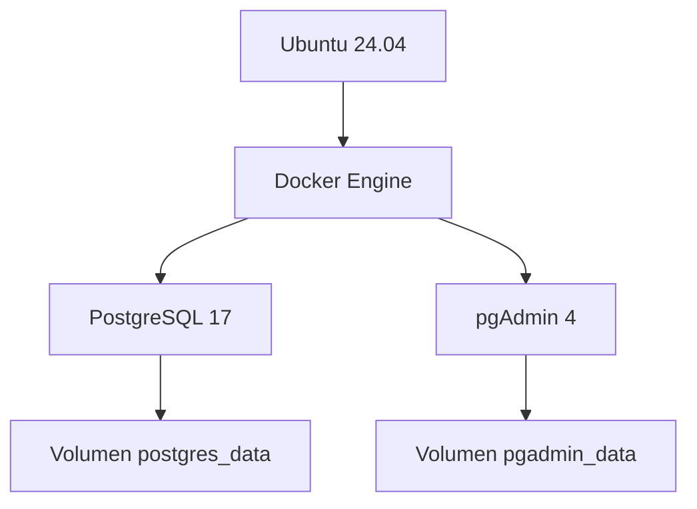

# 03. Docker

**Proyecto:** Portal Pericial  
**Versión:** 1.0  
**Última actualización:** 12/07/2026

---

# Índice

1. Objetivo
2. Arquitectura
3. ¿Por qué Docker?
4. Instalación
5. Organización del proyecto
6. Docker Compose
7. Volúmenes
8. Operaciones habituales
9. Actualización
10. Backup
11. Problemas encontrados
12. Buenas prácticas
13. Referencias

---

# 1. Objetivo

Docker se utiliza para ejecutar servicios independientes del sistema operativo, facilitando su mantenimiento, actualización y migración.

Actualmente Docker administra:

- PostgreSQL 17
- pgAdmin 4

En el futuro podrán agregarse otros servicios, manteniendo la misma arquitectura.

---

# 2. Arquitectura



Docker proporciona aislamiento entre los servicios y el sistema operativo, mientras que los datos permanecen almacenados en volúmenes persistentes.

---

# 3. ¿Por qué Docker?

Se eligió Docker por las siguientes razones:

- Aislamiento entre servicios.
- Actualizaciones sencillas.
- Facilidad para migrar el servidor.
- Persistencia mediante volúmenes.
- Reproducibilidad de la infraestructura.

La filosofía adoptada es:

- Ubuntu administra el servidor.
- Docker administra los servicios.

---

# 4. Instalación

Verificar versiones instaladas.

```bash
docker --version
docker compose version
```

Comprobar que el servicio esté iniciado.

```bash
sudo systemctl status docker
```

---

# 5. Organización del proyecto

Toda la configuración Docker se encuentra en:

```text
/opt/postgresql
```

Contenido:

```text
/opt/postgresql
├── .env
├── docker-compose.yml
└── docker-compose.yml.bak
```

---

# 6. Docker Compose

La infraestructura se administra mediante un único archivo `docker-compose.yml`.

Servicios definidos:

| Servicio | Función |
|----------|---------|
| postgres | Base de datos PostgreSQL |
| pgadmin | Administración de PostgreSQL |

La configuración sensible se almacena en el archivo `.env`.

---

# 7. Volúmenes

Se utilizan dos volúmenes persistentes.

| Volumen | Función |
|----------|----------|
| postgres_data | Datos de PostgreSQL |
| pgadmin_data | Configuración de pgAdmin |

Verificar volúmenes:

```bash
docker volume ls
```

Inspeccionar un volumen:

```bash
docker volume inspect postgres_data
```

---

# 8. Operaciones habituales

## Iniciar servicios

```bash
docker compose up -d
```

---

## Detener servicios

```bash
docker compose stop
```

---

## Reiniciar servicios

```bash
docker compose restart
```

---

## Ver estado

```bash
docker compose ps
```

---

## Ver logs

Todos los servicios:

```bash
docker compose logs
```

Solo PostgreSQL:

```bash
docker compose logs postgres
```

Solo pgAdmin:

```bash
docker compose logs pgadmin
```

En tiempo real:

```bash
docker compose logs -f
```

---

# 9. Actualización

Descargar nuevas imágenes:

```bash
docker compose pull
```

Recrear los contenedores:

```bash
docker compose up -d
```

Los datos permanecen almacenados en los volúmenes, por lo que no se pierden durante la actualización.

---

# 10. Backup

Antes de modificar la infraestructura:

Crear una copia del archivo de configuración.

```bash
cp docker-compose.yml docker-compose.yml.bak
```

También deben respaldarse:

- `.env`
- `docker-compose.yml`
- Volúmenes Docker

La estrategia completa de respaldo se describe en:

**08-Backup-y-Restore.md**

---

# 11. Problemas encontrados

## Publicación del puerto PostgreSQL

Inicialmente PostgreSQL estaba publicado mediante:

```text
5432:5432
```

Esto permitía conexiones externas.

Se modificó por:

```text
127.0.0.1:5432:5432
```

De esta manera PostgreSQL únicamente acepta conexiones desde el propio servidor.

---

## Publicación del puerto pgAdmin

Inicialmente el puerto 5050 era accesible directamente.

La configuración final quedó:

```text
127.0.0.1:5050:80
```

CloudPanel publica el servicio mediante Reverse Proxy.

---

# 12. Buenas prácticas

- Utilizar imágenes oficiales.
- No modificar contenedores manualmente.
- Mantener la configuración en `docker-compose.yml`.
- Guardar las credenciales en `.env`.
- Realizar backups antes de modificar la infraestructura.
- No publicar servicios innecesarios.
- Mantener Docker actualizado.

---

# 13. Referencias

- 01-Infraestructura-Servidor.md
- 02-CloudPanel.md
- 04-PostgreSQL.md
- 05-pgAdmin.md
- Documentación oficial de Docker
- Documentación oficial de Docker Compose