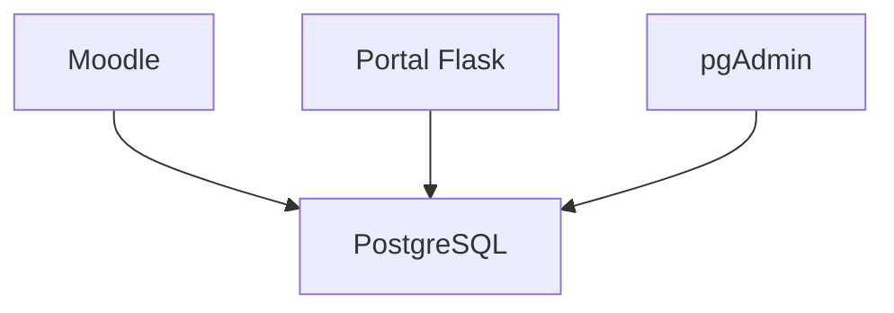

# 04. PostgreSQL

**Proyecto:** Portal Pericial  
**Versión:** 1.0  
**Última actualización:** 12/07/2026

---

# Índice

1. Objetivo
2. Arquitectura
3. Organización de las bases de datos
4. Acceso al servidor
5. Administración mediante pgAdmin
6. Administración mediante consola
7. Operaciones habituales
8. Mantenimiento
9. Seguridad
10. Problemas encontrados
11. Buenas prácticas
12. Referencias

---

# 1. Objetivo

PostgreSQL es el motor de base de datos central del servidor.

Todas las aplicaciones utilizarán la misma instancia de PostgreSQL, manteniendo una separación lógica mediante bases de datos independientes.

Actualmente aloja:

- Moodle

En el futuro alojará:

- Portal Pericial
- Healthcare360
- Otras aplicaciones

---

# 2. Arquitectura



Cada aplicación tendrá su propia base de datos, pero todas compartirán la misma instancia de PostgreSQL.

---

# 3. Organización de las bases de datos

La estrategia adoptada consiste en mantener una única instancia de PostgreSQL.

Cada aplicación tendrá:

- Su propia base de datos.
- Su propio usuario.
- Sus propios permisos.

Las aplicaciones nunca compartirán tablas.

### Bases actuales

| Base | Uso |
|------|-----|
| postgres | Base administrativa del sistema |
| moodle | Plataforma Moodle |

### Bases futuras

| Base | Uso |
|------|-----|
| portalpericial | Portal institucional |
| healthcare360 | Proyecto Healthcare360 |

---

# 4. Acceso al servidor

PostgreSQL escucha únicamente en:

```text
127.0.0.1:5432
```

No acepta conexiones externas.

Esto reduce considerablemente la superficie de ataque.

---

# 5. Administración mediante pgAdmin

La administración principal se realiza mediante:

```
https://pgadmin.portalpericial.com.ar
```

Desde pgAdmin pueden realizarse todas las tareas administrativas:

- Crear bases.
- Crear usuarios.
- Ejecutar consultas.
- Realizar backups.
- Restaurar bases.
- Consultar actividad.
- Revisar logs.

---

# 6. Administración mediante consola

Ingresar al contenedor:

```bash
docker exec -it postgres bash
```

Conectarse a PostgreSQL:

```bash
psql -U marianagil
```

Salir:

```bash
exit
```

---

# 7. Operaciones habituales

## Ver bases existentes

```sql
SELECT datname
FROM pg_database
ORDER BY datname;
```

---

## Ver usuarios

```sql
SELECT rolname
FROM pg_roles
ORDER BY rolname;
```

---

## Ver conexiones activas

```sql
SELECT *
FROM pg_stat_activity;
```

---

## Ver tamaño de las bases

```sql
SELECT
    datname,
    pg_size_pretty(pg_database_size(datname))
FROM pg_database
ORDER BY datname;
```

---

## Cambiar la contraseña de un usuario

```sql
ALTER USER nombre_usuario
WITH PASSWORD 'NuevaContraseña';
```

---

# 8. Mantenimiento

Las siguientes tareas deben realizarse periódicamente en bases de datos de gran tamaño:

- VACUUM
- ANALYZE
- REINDEX

Estas operaciones ayudan a mantener un buen rendimiento.

---

# 9. Seguridad

La configuración actual cumple las siguientes políticas:

- PostgreSQL no está publicado en Internet.
- El acceso se realiza únicamente desde localhost.
- La administración web se realiza mediante HTTPS.
- Docker proporciona aislamiento respecto del sistema operativo.

---

# 10. Problemas encontrados

## PostgreSQL publicado en Internet

Inicialmente el puerto 5432 se encontraba expuesto.

La configuración fue modificada para aceptar conexiones únicamente desde:

```text
127.0.0.1
```

Con esto se eliminó el acceso directo desde Internet.

---

# 11. Buenas prácticas

- Crear un usuario diferente para cada aplicación.
- No utilizar el usuario administrador para aplicaciones.
- Realizar backups antes de cambios importantes.
- Mantener PostgreSQL actualizado.
- No modificar tablas directamente si la aplicación dispone de herramientas para hacerlo.
- Documentar cualquier cambio estructural realizado sobre las bases.

---

# 12. Referencias

- 03-Docker.md
- 05-pgAdmin.md
- 08-Backup-y-Restore.md
- Documentación oficial de PostgreSQL