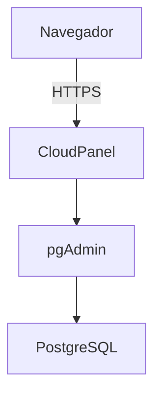

# 05. pgAdmin

**Proyecto:** Portal Pericial  
**Versión:** 1.0  
**Última actualización:** 12/07/2026

---

# Índice

1. Objetivo
2. Arquitectura
3. Acceso
4. Primer inicio
5. Registro del servidor PostgreSQL
6. Operaciones habituales
7. Seguridad
8. Problemas encontrados
9. Buenas prácticas
10. Referencias

---

# 1. Objetivo

pgAdmin es la herramienta oficial utilizada para administrar PostgreSQL mediante una interfaz web.

Su utilización evita trabajar directamente desde la consola para la mayoría de las tareas administrativas.

Actualmente se utiliza para:

- Administrar bases de datos.
- Crear usuarios.
- Ejecutar consultas SQL.
- Realizar backups.
- Restaurar bases de datos.
- Supervisar la actividad del servidor.

---

# 2. Arquitectura



pgAdmin nunca se publica directamente en Internet.

Todo el acceso se realiza mediante CloudPanel y HTTPS.

---

# 3. Acceso

URL

```
https://pgadmin.portalpericial.com.ar
```

La autenticación inicial utiliza las credenciales definidas en el archivo `.env`.

Estas credenciales **únicamente sirven para ingresar a pgAdmin**.

No corresponden a usuarios de PostgreSQL.

---

# 4. Primer inicio

Al ingresar por primera vez se solicita:

- Correo electrónico.
- Contraseña.

Una vez autenticado, pgAdmin no contiene servidores registrados.

Es necesario registrar manualmente la instancia de PostgreSQL.

---

# 5. Registro del servidor PostgreSQL

## General

| Campo | Valor |
|--------|-------|
| Name | PostgreSQL Moodle |

---

## Connection

| Campo | Valor |
|--------|-------|
| Host | postgres |
| Port | 5432 |
| Maintenance Database | moodle |
| Username | marianagil |
| Password | Contraseña PostgreSQL |
| Save Password | Sí |

El nombre `postgres` corresponde al servicio definido en Docker Compose.

No debe utilizarse `localhost` ni la IP pública.

---

# 6. Operaciones habituales

## Crear una base de datos

```
Databases
    └── Create
            └── Database
```

---

## Crear un usuario

```
Login Roles
      └── Create
             └── Login Role
```

---

## Ejecutar SQL

```
Botón derecho sobre la base

↓

Query Tool
```

---

## Realizar un backup

```
Botón derecho sobre la base

↓

Backup
```

Formato recomendado:

- Custom

---

## Restaurar un backup

```
Botón derecho sobre la base

↓

Restore
```

---

## Consultar actividad

Seleccionar el servidor y abrir:

```
Dashboard
```

Desde allí es posible visualizar:

- Sesiones activas.
- Consultas.
- Uso de CPU.
- Estadísticas.
- Locks.

---

# 7. Seguridad

La configuración adoptada cumple las siguientes políticas:

- Acceso únicamente mediante HTTPS.
- Reverse Proxy administrado por CloudPanel.
- Puerto 5050 accesible solo desde localhost.
- PostgreSQL no expuesto a Internet.

---

# 8. Problemas encontrados

## DNS

Inicialmente el subdominio:

```
pgadmin.portalpericial.com.ar
```

no resolvía correctamente.

Se solucionó agregando el registro tipo A correspondiente.

---

## Certificado

Chrome mostraba:

```
No seguro
```

La causa fue una política HSTS almacenada localmente.

El certificado Let's Encrypt era válido.

La solución consistió en eliminar la política HSTS del dominio.

---

## Conexión PostgreSQL

El servidor debía registrarse utilizando:

```
Host: postgres
```

No debía utilizarse:

- localhost
- 127.0.0.1
- IP pública

Esto es posible porque ambos contenedores pertenecen a la misma red Docker.

---

# 9. Buenas prácticas

- Acceder siempre mediante HTTPS.
- No publicar directamente el puerto 5050.
- Mantener pgAdmin actualizado.
- Utilizar pgAdmin únicamente para tareas administrativas.
- Realizar backups antes de modificaciones importantes.
- No almacenar contraseñas en documentos de texto.

---

# 10. Referencias

- 03-Docker.md
- 04-PostgreSQL.md
- 07-Seguridad.md
- Documentación oficial de pgAdmin