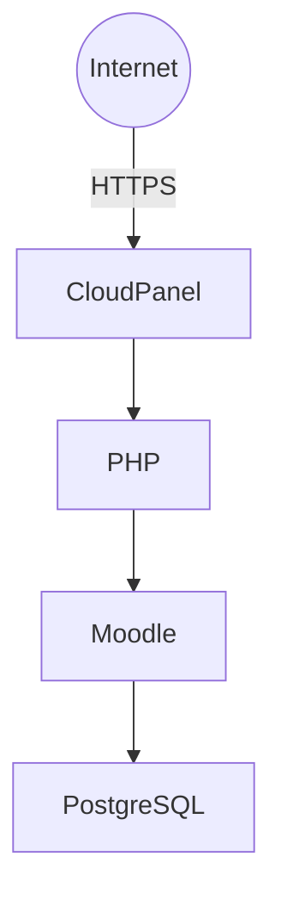

# 06. Moodle

**Proyecto:** Portal Pericial  
**Versión:** 1.0  
**Última actualización:** 12/07/2026

---

# Índice

1. Objetivo
2. Arquitectura
3. Componentes
4. Requisitos
5. Instalación
6. Configuración de la base de datos
7. Configuración de Moodle
8. Cron
9. Backups
10. Actualización
11. Problemas encontrados
12. Buenas prácticas
13. Referencias

---

# 1. Objetivo

Este documento describe la instalación, configuración y administración de Moodle dentro de la infraestructura del proyecto **Portal Pericial**.

Moodle constituye la plataforma de capacitación del proyecto y utiliza PostgreSQL como motor de base de datos.

---

# 2. Arquitectura



---

# 3. Componentes

La instalación de Moodle está compuesta por cuatro elementos.

| Componente | Descripción |
|------------|-------------|
| Código fuente | Archivos de Moodle |
| Base de datos | PostgreSQL |
| config.php | Configuración del sitio |
| moodledata | Archivos cargados por los usuarios |

Los cuatro componentes son necesarios para restaurar completamente la plataforma.

---

# 4. Requisitos

| Componente | Versión |
|------------|----------|
| Ubuntu | 24.04 LTS |
| PHP | 8.4 |
| PostgreSQL | 17 |
| CloudPanel | Instalado |

---

# 5. Instalación

## Directorio del sitio

```
/home/portalpericial-campus/htdocs/campus.portalpericial.com.ar/
```

El código de Moodle se encuentra dentro del directorio:

```
public
```

El Document Root configurado en CloudPanel apunta a:

```
public
```

---

## Extensión PostgreSQL para PHP

Instalar:

```bash
sudo apt update
sudo apt install php8.4-pgsql
```

Reiniciar PHP:

```bash
sudo systemctl restart php8.4-fpm
```

Verificar:

```bash
sudo systemctl status php8.4-fpm
```

---

# 6. Configuración de la base de datos

Durante la instalación utilizar:

| Parámetro | Valor |
|------------|--------|
| Motor | PostgreSQL |
| Host | 127.0.0.1 |
| Puerto | 5432 |
| Base | moodle |
| Usuario | Usuario PostgreSQL |
| Contraseña | Contraseña PostgreSQL |

---

# 7. Configuración de Moodle

Toda la configuración principal se almacena en:

```
config.php
```

Este archivo contiene:

- URL del sitio.
- Configuración de PostgreSQL.
- Rutas.
- Configuración del directorio moodledata.

Debe incluirse siempre en cualquier backup.

---

# 8. Cron

Moodle requiere ejecutar periódicamente su proceso de mantenimiento.

Archivo:

```
admin/cli/cron.php
```

Pendiente de configurar mediante cron del sistema.

---

# 9. Backups

Una copia completa de Moodle debe incluir:

- Base PostgreSQL.
- Código fuente.
- config.php.
- moodledata.

Si falta alguno de estos elementos, la restauración no será completa.

---

# 10. Actualización

Antes de actualizar Moodle:

1. Backup PostgreSQL.
2. Backup del código.
3. Backup de moodledata.
4. Backup de config.php.

Una vez realizados los respaldos, proceder con la actualización siguiendo la documentación oficial.

---

# 11. Problemas encontrados

## Error HTTP 500

### Causa

Document Root incorrecto.

### Solución

Configurar CloudPanel para utilizar el directorio:

```
public
```

---

## Error PHP PGSQL

### Causa

La extensión PostgreSQL para PHP no estaba instalada.

### Solución

```bash
sudo apt install php8.4-pgsql
```

---

# 12. Buenas prácticas

- No modificar directamente la base de datos.
- Mantener Moodle actualizado.
- Mantener PHP actualizado.
- Utilizar únicamente plugins compatibles.
- Probar las actualizaciones primero en un entorno de pruebas cuando sea posible.
- Realizar siempre un backup completo antes de actualizar.

---

# 13. Referencias

- 02-CloudPanel.md
- 04-PostgreSQL.md
- 08-Backup-y-Restore.md
- Documentación oficial de Moodle