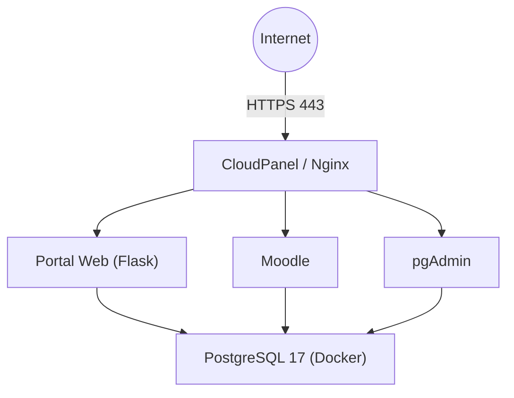

# Portal Pericial - Documentación de Infraestructura

**Proyecto:** Portal Pericial  
**Versión:** 1.0  
**Última actualización:** 12/07/2026

---

## Descripción

Este repositorio contiene la documentación técnica necesaria para instalar, administrar, mantener y reconstruir la infraestructura del proyecto **Portal Pericial**.

La documentación está organizada en documentos independientes, cada uno dedicado a un único tema. Esto facilita el mantenimiento y evita la duplicación de información.

El objetivo es que cualquier administrador pueda reconstruir completamente el servidor siguiendo estos documentos, sin depender de conversaciones, notas personales o tutoriales externos.

---

# Arquitectura general



---

# Documentación

| Documento | Descripción |
|------------|-------------|
| [01 - Infraestructura del Servidor](01-Infraestructura-Servidor.md) | Arquitectura general del servidor y decisiones de diseño. |
| [02 - CloudPanel](02-CloudPanel.md) | Instalación y configuración de CloudPanel. |
| [03 - Docker](03-Docker.md) | Instalación y administración de Docker y Docker Compose. |
| [04 - PostgreSQL](04-PostgreSQL.md) | Administración del servidor PostgreSQL. |
| [05 - pgAdmin](05-pgAdmin.md) | Configuración y uso de pgAdmin. |
| [06 - Moodle](06-Moodle.md) | Instalación y administración de Moodle. |
| [07 - Seguridad](07-Seguridad.md) | Políticas de seguridad del servidor. |
| [08 - Backup y Restore](08-Backup-y-Restore.md) | Estrategia de respaldo y recuperación. |
| [09 - Mantenimiento](09-Mantenimiento.md) | Procedimientos de mantenimiento preventivo. |
| [10 - Reconstrucción del Servidor](10-Reconstruccion-Servidor.md) | Procedimiento completo para reconstruir el servidor desde cero. |

---

# Tecnologías utilizadas

| Componente | Tecnología |
|------------|------------|
| Sistema Operativo | Ubuntu 24.04 LTS |
| Panel de Administración | CloudPanel |
| Servidor Web | Nginx |
| Base de Datos | PostgreSQL 17 |
| Administración PostgreSQL | pgAdmin 4 |
| Contenedores | Docker |
| Orquestación | Docker Compose |
| Plataforma Educativa | Moodle |
| Aplicaciones propias | Python / Flask |
| Certificados | Let's Encrypt |

---

# Organización del servidor

```text
/
├── /opt
│   └── /postgresql
│       ├── .env
│       ├── docker-compose.yml
│       └── docker-compose.yml.bak
│
├── /home
│   └── portalpericial-campus
│       └── htdocs
│           └── campus.portalpericial.com.ar
│
└── ...
```

---

# Convenciones utilizadas

## Dominios

| Servicio | URL |
|----------|-----|
| Portal Principal | https://portalpericial.com.ar |
| Moodle | https://campus.portalpericial.com.ar |
| pgAdmin | https://pgadmin.portalpericial.com.ar |
| CloudPanel | https://cloudpanel.portalpericial.com.ar:8443 |

---

## Puertos

| Puerto | Uso |
|---------|-----|
| 80 | HTTP |
| 443 | HTTPS |
| 5650 | SSH |
| 5432 | PostgreSQL (solo localhost) |
| 5050 | pgAdmin (solo localhost) |

---

## Principios de diseño

La infraestructura se basa en los siguientes principios:

- Exponer únicamente los servicios necesarios a Internet.
- Utilizar HTTPS en todos los servicios públicos.
- Mantener PostgreSQL aislado dentro de Docker.
- Publicar pgAdmin únicamente mediante Reverse Proxy.
- Documentar todas las modificaciones realizadas.
- Mantener procedimientos reproducibles para facilitar futuras migraciones.

---

# Estado de la documentación

Esta documentación se encuentra en evolución y deberá actualizarse cada vez que se modifique la infraestructura.

Cada documento mantiene un único tema para evitar inconsistencias y facilitar su mantenimiento.

---

# Referencias

- Documentación oficial de Ubuntu
- Documentación oficial de CloudPanel
- Documentación oficial de Docker
- Documentación oficial de PostgreSQL
- Documentación oficial de pgAdmin
- Documentación oficial de Moodle